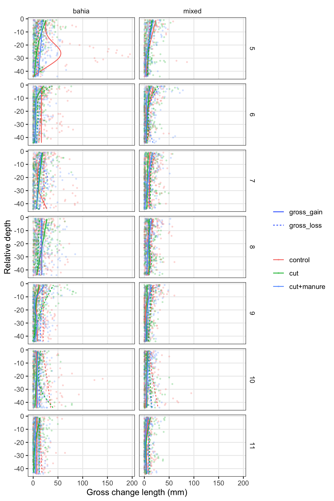

Highlighted results
================
2021-07-07

-   [Gross gain and loss](#gross-gain-and-loss)
    -   [Gross change models table](#gross-change-models-table)
    -   [Gross change models plots](#gross-change-models-plots)
-   [Production](#production)
    -   [Total root length](#total-root-length)
        -   [What’s up with length x depth in each
            tube?](#whats-up-with-length-x-depth-in-each-tube)
        -   [Tube level aggregation](#tube-level-aggregation)
    -   [Average root diameter](#average-root-diameter)
        -   [Depth window aggregation](#depth-window-aggregation)
        -   [Tube level aggregation](#tube-level-aggregation-1)
    -   [Root volume](#root-volume)
        -   [Depth window aggregation](#depth-window-aggregation-1)
        -   [Tube level aggregation](#tube-level-aggregation-2)

Evaluate effects of treatment (cutting-only, cutting + manure) and
composition (bahia, peanut mix)

1.  Gross gain and gross loss - effects of treatment and composition

2.  Production by treatment and composition - alive length, volume,
    diameter

-   Total length
-   Average diameter
-   Average vs. total volume

1.  LAI model vs. Treatment model (subset of data with no missing LAI
    values)

# Gross gain and loss

**Gross Gain**: growth of existing roots + new roots

**Gross Loss**: loss of existing roots + dead roots + gone roots

<!-- -->

Gross gain (solid line) and gross loss (dashed line) in root length
across sampling depths for each month after the initial sampling in
April. Color indicates treatment.

<!-- -->

Bahia generally has greater values than mixed.

### Gross change models table

<table style="border-collapse:collapse; border:none;">
<tr>
<th style="border-top: double; text-align:center; font-style:normal; font-weight:bold; padding:0.2cm;  text-align:left; ">
 
</th>
<th colspan="3" style="border-top: double; text-align:center; font-style:normal; font-weight:bold; padding:0.2cm; ">
Gross gain
</th>
<th colspan="3" style="border-top: double; text-align:center; font-style:normal; font-weight:bold; padding:0.2cm; ">
Gross loss
</th>
</tr>
<tr>
<td style=" text-align:center; border-bottom:1px solid; font-style:italic; font-weight:normal;  text-align:left; ">
Predictors
</td>
<td style=" text-align:center; border-bottom:1px solid; font-style:italic; font-weight:normal;  ">
Estimates
</td>
<td style=" text-align:center; border-bottom:1px solid; font-style:italic; font-weight:normal;  ">
CI
</td>
<td style=" text-align:center; border-bottom:1px solid; font-style:italic; font-weight:normal;  ">
p
</td>
<td style=" text-align:center; border-bottom:1px solid; font-style:italic; font-weight:normal;  ">
Estimates
</td>
<td style=" text-align:center; border-bottom:1px solid; font-style:italic; font-weight:normal;  ">
CI
</td>
<td style=" text-align:center; border-bottom:1px solid; font-style:italic; font-weight:normal;  col7">
p
</td>
</tr>
<tr>
<td style=" padding:0.2cm; text-align:left; vertical-align:top; text-align:left; ">
(Intercept)
</td>
<td style=" padding:0.2cm; text-align:left; vertical-align:top; text-align:center;  ">
73.09
</td>
<td style=" padding:0.2cm; text-align:left; vertical-align:top; text-align:center;  ">
46.37 – 99.81
</td>
<td style=" padding:0.2cm; text-align:left; vertical-align:top; text-align:center;  ">
<strong>&lt;0.001
</td>
<td style=" padding:0.2cm; text-align:left; vertical-align:top; text-align:center;  ">
58.96
</td>
<td style=" padding:0.2cm; text-align:left; vertical-align:top; text-align:center;  ">
34.22 – 83.69
</td>
<td style=" padding:0.2cm; text-align:left; vertical-align:top; text-align:center;  col7">
<strong>&lt;0.001
</td>
</tr>
<tr>
<td style=" padding:0.2cm; text-align:left; vertical-align:top; text-align:left; ">
Clipped \[yes\]
</td>
<td style=" padding:0.2cm; text-align:left; vertical-align:top; text-align:center;  ">
-10.39
</td>
<td style=" padding:0.2cm; text-align:left; vertical-align:top; text-align:center;  ">
-42.49 – 21.71
</td>
<td style=" padding:0.2cm; text-align:left; vertical-align:top; text-align:center;  ">
0.526
</td>
<td style=" padding:0.2cm; text-align:left; vertical-align:top; text-align:center;  ">
-6.37
</td>
<td style=" padding:0.2cm; text-align:left; vertical-align:top; text-align:center;  ">
-35.85 – 23.12
</td>
<td style=" padding:0.2cm; text-align:left; vertical-align:top; text-align:center;  col7">
0.672
</td>
</tr>
<tr>
<td style=" padding:0.2cm; text-align:left; vertical-align:top; text-align:left; ">
Composition \[mixed\]
</td>
<td style=" padding:0.2cm; text-align:left; vertical-align:top; text-align:center;  ">
-23.53
</td>
<td style=" padding:0.2cm; text-align:left; vertical-align:top; text-align:center;  ">
-49.73 – 2.67
</td>
<td style=" padding:0.2cm; text-align:left; vertical-align:top; text-align:center;  ">
0.078
</td>
<td style=" padding:0.2cm; text-align:left; vertical-align:top; text-align:center;  ">
-16.36
</td>
<td style=" padding:0.2cm; text-align:left; vertical-align:top; text-align:center;  ">
-40.43 – 7.71
</td>
<td style=" padding:0.2cm; text-align:left; vertical-align:top; text-align:center;  col7">
0.183
</td>
</tr>
<tr>
<td style=" padding:0.2cm; text-align:left; vertical-align:top; text-align:left; ">
Clipped \* manure
</td>
<td style=" padding:0.2cm; text-align:left; vertical-align:top; text-align:center;  ">
-1.38
</td>
<td style=" padding:0.2cm; text-align:left; vertical-align:top; text-align:center;  ">
-33.47 – 30.71
</td>
<td style=" padding:0.2cm; text-align:left; vertical-align:top; text-align:center;  ">
0.933
</td>
<td style=" padding:0.2cm; text-align:left; vertical-align:top; text-align:center;  ">
1.65
</td>
<td style=" padding:0.2cm; text-align:left; vertical-align:top; text-align:center;  ">
-27.82 – 31.12
</td>
<td style=" padding:0.2cm; text-align:left; vertical-align:top; text-align:center;  col7">
0.913
</td>
</tr>
<tr>
<td colspan="7" style="font-weight:bold; text-align:left; padding-top:.8em;">
Random Effects
</td>
</tr>
<tr>
<td style=" padding:0.2cm; text-align:left; vertical-align:top; text-align:left; padding-top:0.1cm; padding-bottom:0.1cm;">
σ2
</td>
<td style=" padding:0.2cm; text-align:left; vertical-align:top; padding-top:0.1cm; padding-bottom:0.1cm; text-align:left;" colspan="3">
1621.28
</td>
<td style=" padding:0.2cm; text-align:left; vertical-align:top; padding-top:0.1cm; padding-bottom:0.1cm; text-align:left;" colspan="3">
1567.91
</td>
<tr>
<td style=" padding:0.2cm; text-align:left; vertical-align:top; text-align:left; padding-top:0.1cm; padding-bottom:0.1cm;">
τ00
</td>
<td style=" padding:0.2cm; text-align:left; vertical-align:top; padding-top:0.1cm; padding-bottom:0.1cm; text-align:left;" colspan="3">
310.00 Location
</td>
<td style=" padding:0.2cm; text-align:left; vertical-align:top; padding-top:0.1cm; padding-bottom:0.1cm; text-align:left;" colspan="3">
368.70 Location
</td>
<tr>
<td style=" padding:0.2cm; text-align:left; vertical-align:top; text-align:left; padding-top:0.1cm; padding-bottom:0.1cm;">
</td>
<td style=" padding:0.2cm; text-align:left; vertical-align:top; padding-top:0.1cm; padding-bottom:0.1cm; text-align:left;" colspan="3">
1034.25 Tube
</td>
<td style=" padding:0.2cm; text-align:left; vertical-align:top; padding-top:0.1cm; padding-bottom:0.1cm; text-align:left;" colspan="3">
867.77 Tube
</td>
<tr>
<td style=" padding:0.2cm; text-align:left; vertical-align:top; text-align:left; padding-top:0.1cm; padding-bottom:0.1cm;">
ICC
</td>
<td style=" padding:0.2cm; text-align:left; vertical-align:top; padding-top:0.1cm; padding-bottom:0.1cm; text-align:left;" colspan="3">
0.45
</td>
<td style=" padding:0.2cm; text-align:left; vertical-align:top; padding-top:0.1cm; padding-bottom:0.1cm; text-align:left;" colspan="3">
0.44
</td>
<tr>
<td style=" padding:0.2cm; text-align:left; vertical-align:top; text-align:left; padding-top:0.1cm; padding-bottom:0.1cm;">
N
</td>
<td style=" padding:0.2cm; text-align:left; vertical-align:top; padding-top:0.1cm; padding-bottom:0.1cm; text-align:left;" colspan="3">
44 Location
</td>
<td style=" padding:0.2cm; text-align:left; vertical-align:top; padding-top:0.1cm; padding-bottom:0.1cm; text-align:left;" colspan="3">
44 Location
</td>
<tr>
<td style=" padding:0.2cm; text-align:left; vertical-align:top; text-align:left; padding-top:0.1cm; padding-bottom:0.1cm;">
</td>
<td style=" padding:0.2cm; text-align:left; vertical-align:top; padding-top:0.1cm; padding-bottom:0.1cm; text-align:left;" colspan="3">
24 Tube
</td>
<td style=" padding:0.2cm; text-align:left; vertical-align:top; padding-top:0.1cm; padding-bottom:0.1cm; text-align:left;" colspan="3">
24 Tube
</td>
<tr>
<td style=" padding:0.2cm; text-align:left; vertical-align:top; text-align:left; padding-top:0.1cm; padding-bottom:0.1cm; border-top:1px solid;">
Observations
</td>
<td style=" padding:0.2cm; text-align:left; vertical-align:top; padding-top:0.1cm; padding-bottom:0.1cm; text-align:left; border-top:1px solid;" colspan="3">
1020
</td>
<td style=" padding:0.2cm; text-align:left; vertical-align:top; padding-top:0.1cm; padding-bottom:0.1cm; text-align:left; border-top:1px solid;" colspan="3">
1020
</td>
</tr>
<tr>
<td style=" padding:0.2cm; text-align:left; vertical-align:top; text-align:left; padding-top:0.1cm; padding-bottom:0.1cm;">
Marginal R2 / Conditional R2
</td>
<td style=" padding:0.2cm; text-align:left; vertical-align:top; padding-top:0.1cm; padding-bottom:0.1cm; text-align:left;" colspan="3">
0.053 / 0.482
</td>
<td style=" padding:0.2cm; text-align:left; vertical-align:top; padding-top:0.1cm; padding-bottom:0.1cm; text-align:left;" colspan="3">
0.026 / 0.455
</td>
</tr>
</table>

If we compare the intercepts the overall average gain is greater than
the overall average loss in root length.

### Gross change models plots

<!-- -->

Application of manure appears to reduce the weakly negative effect of
clipping. Gain and loss (turnover) were lower in the mixed composition
than bahia.

<!-- -->

Random effects of depth and tube have similar general patterns for gain
and loss, with more turnover occurring in the top 10 cm of the soil
profile (what would the actual soil depth be given the angle of the
tube?)

# Production

Here we build and examine models for three metrics of production,
i.e. live roots: total root length at each depth window in each tube for
each month. The production response was modeled using treatment
(clipped, clipped x manure, control), composition (mixed or bahia), soil
temperature, and soil moisture as fixed effects, and depth, tube within
block, and sampling month as varying-intercept random effects.

## Total root length

    ## [1] "$$\n\\begin{aligned}\n  \\operatorname{tot\\_length\\_mm}_{i}  &\\sim N \\left(\\alpha_{j[i],k[i],l[i],m[i]} + \\beta_{1}(\\operatorname{max\\_temp}) + \\beta_{2}(\\operatorname{avg\\_vwc}), \\sigma^2 \\right) \\\\\n    \\alpha_{j}  &\\sim N \\left(\\mu_{\\alpha_{j}}, \\sigma^2_{\\alpha_{j}} \\right)\n    \\text{, for depth j = 1,} \\dots \\text{,J} \\\\\n    \\alpha_{k}  &\\sim N \\left(\\gamma_{0}^{\\alpha} + \\gamma_{1}^{\\alpha}(\\operatorname{clipped}_{\\operatorname{yes}}) + \\gamma_{2}^{\\alpha}(\\operatorname{clipped}_{\\operatorname{yes}} \\times \\operatorname{clipped}_{\\operatorname{manureyes}}), \\sigma^2_{\\alpha_{k}} \\right)\n    \\text{, for Tube:block k = 1,} \\dots \\text{,K} \\\\\n    \\alpha_{l}  &\\sim N \\left(\\gamma_{0}^{\\alpha} + \\gamma_{1}^{\\alpha}(\\operatorname{composition}_{\\operatorname{mixed}}), \\sigma^2_{\\alpha_{l}} \\right)\n    \\text{, for block l = 1,} \\dots \\text{,L} \\\\\n    \\alpha_{m}  &\\sim N \\left(\\mu_{\\alpha_{m}}, \\sigma^2_{\\alpha_{m}} \\right)\n    \\text{, for month_num m = 1,} \\dots \\text{,M}\n\\end{aligned}\n$$\n"

<table style="border-collapse:collapse; border:none;">
<tr>
<th style="border-top: double; text-align:center; font-style:normal; font-weight:bold; padding:0.2cm;  text-align:left; ">
 
</th>
<th colspan="3" style="border-top: double; text-align:center; font-style:normal; font-weight:bold; padding:0.2cm; ">
Total root length (mm)
</th>
</tr>
<tr>
<td style=" text-align:center; border-bottom:1px solid; font-style:italic; font-weight:normal;  text-align:left; ">
Predictors
</td>
<td style=" text-align:center; border-bottom:1px solid; font-style:italic; font-weight:normal;  ">
Estimates
</td>
<td style=" text-align:center; border-bottom:1px solid; font-style:italic; font-weight:normal;  ">
CI
</td>
<td style=" text-align:center; border-bottom:1px solid; font-style:italic; font-weight:normal;  ">
p
</td>
</tr>
<tr>
<td style=" padding:0.2cm; text-align:left; vertical-align:top; text-align:left; ">
(Intercept)
</td>
<td style=" padding:0.2cm; text-align:left; vertical-align:top; text-align:center;  ">
66.12
</td>
<td style=" padding:0.2cm; text-align:left; vertical-align:top; text-align:center;  ">
29.18 – 103.05
</td>
<td style=" padding:0.2cm; text-align:left; vertical-align:top; text-align:center;  ">
<strong>&lt;0.001
</td>
</tr>
<tr>
<td style=" padding:0.2cm; text-align:left; vertical-align:top; text-align:left; ">
Max. temp.
</td>
<td style=" padding:0.2cm; text-align:left; vertical-align:top; text-align:center;  ">
-0.86
</td>
<td style=" padding:0.2cm; text-align:left; vertical-align:top; text-align:center;  ">
-2.12 – 0.41
</td>
<td style=" padding:0.2cm; text-align:left; vertical-align:top; text-align:center;  ">
0.186
</td>
</tr>
<tr>
<td style=" padding:0.2cm; text-align:left; vertical-align:top; text-align:left; ">
Avg. VWC
</td>
<td style=" padding:0.2cm; text-align:left; vertical-align:top; text-align:center;  ">
0.11
</td>
<td style=" padding:0.2cm; text-align:left; vertical-align:top; text-align:center;  ">
-0.26 – 0.47
</td>
<td style=" padding:0.2cm; text-align:left; vertical-align:top; text-align:center;  ">
0.559
</td>
</tr>
<tr>
<td style=" padding:0.2cm; text-align:left; vertical-align:top; text-align:left; ">
Clipped \[yes\]
</td>
<td style=" padding:0.2cm; text-align:left; vertical-align:top; text-align:center;  ">
-6.63
</td>
<td style=" padding:0.2cm; text-align:left; vertical-align:top; text-align:center;  ">
-20.42 – 7.17
</td>
<td style=" padding:0.2cm; text-align:left; vertical-align:top; text-align:center;  ">
0.346
</td>
</tr>
<tr>
<td style=" padding:0.2cm; text-align:left; vertical-align:top; text-align:left; ">
Composition \[mixed\]
</td>
<td style=" padding:0.2cm; text-align:left; vertical-align:top; text-align:center;  ">
-10.12
</td>
<td style=" padding:0.2cm; text-align:left; vertical-align:top; text-align:center;  ">
-28.77 – 8.53
</td>
<td style=" padding:0.2cm; text-align:left; vertical-align:top; text-align:center;  ">
0.288
</td>
</tr>
<tr>
<td style=" padding:0.2cm; text-align:left; vertical-align:top; text-align:left; ">
Clipped \* manure
</td>
<td style=" padding:0.2cm; text-align:left; vertical-align:top; text-align:center;  ">
3.56
</td>
<td style=" padding:0.2cm; text-align:left; vertical-align:top; text-align:center;  ">
-10.22 – 17.34
</td>
<td style=" padding:0.2cm; text-align:left; vertical-align:top; text-align:center;  ">
0.613
</td>
</tr>
<tr>
<td colspan="4" style="font-weight:bold; text-align:left; padding-top:.8em;">
Random Effects
</td>
</tr>
<tr>
<td style=" padding:0.2cm; text-align:left; vertical-align:top; text-align:left; padding-top:0.1cm; padding-bottom:0.1cm;">
σ2
</td>
<td style=" padding:0.2cm; text-align:left; vertical-align:top; padding-top:0.1cm; padding-bottom:0.1cm; text-align:left;" colspan="3">
698.57
</td>
<tr>
<td style=" padding:0.2cm; text-align:left; vertical-align:top; text-align:left; padding-top:0.1cm; padding-bottom:0.1cm;">
τ00 depth
</td>
<td style=" padding:0.2cm; text-align:left; vertical-align:top; padding-top:0.1cm; padding-bottom:0.1cm; text-align:left;" colspan="3">
22.59
</td>
<tr>
<td style=" padding:0.2cm; text-align:left; vertical-align:top; text-align:left; padding-top:0.1cm; padding-bottom:0.1cm;">
τ00 Tube:block
</td>
<td style=" padding:0.2cm; text-align:left; vertical-align:top; padding-top:0.1cm; padding-bottom:0.1cm; text-align:left;" colspan="3">
195.40
</td>
<tr>
<td style=" padding:0.2cm; text-align:left; vertical-align:top; text-align:left; padding-top:0.1cm; padding-bottom:0.1cm;">
τ00 block
</td>
<td style=" padding:0.2cm; text-align:left; vertical-align:top; padding-top:0.1cm; padding-bottom:0.1cm; text-align:left;" colspan="3">
114.90
</td>
<tr>
<td style=" padding:0.2cm; text-align:left; vertical-align:top; text-align:left; padding-top:0.1cm; padding-bottom:0.1cm;">
τ00 month\_num
</td>
<td style=" padding:0.2cm; text-align:left; vertical-align:top; padding-top:0.1cm; padding-bottom:0.1cm; text-align:left;" colspan="3">
22.82
</td>
<tr>
<td style=" padding:0.2cm; text-align:left; vertical-align:top; text-align:left; padding-top:0.1cm; padding-bottom:0.1cm;">
ICC
</td>
<td style=" padding:0.2cm; text-align:left; vertical-align:top; padding-top:0.1cm; padding-bottom:0.1cm; text-align:left;" colspan="3">
0.34
</td>
<tr>
<td style=" padding:0.2cm; text-align:left; vertical-align:top; text-align:left; padding-top:0.1cm; padding-bottom:0.1cm;">
N depth
</td>
<td style=" padding:0.2cm; text-align:left; vertical-align:top; padding-top:0.1cm; padding-bottom:0.1cm; text-align:left;" colspan="3">
44
</td>
<tr>
<td style=" padding:0.2cm; text-align:left; vertical-align:top; text-align:left; padding-top:0.1cm; padding-bottom:0.1cm;">
N Tube
</td>
<td style=" padding:0.2cm; text-align:left; vertical-align:top; padding-top:0.1cm; padding-bottom:0.1cm; text-align:left;" colspan="3">
24
</td>
<tr>
<td style=" padding:0.2cm; text-align:left; vertical-align:top; text-align:left; padding-top:0.1cm; padding-bottom:0.1cm;">
N block
</td>
<td style=" padding:0.2cm; text-align:left; vertical-align:top; padding-top:0.1cm; padding-bottom:0.1cm; text-align:left;" colspan="3">
8
</td>
<tr>
<td style=" padding:0.2cm; text-align:left; vertical-align:top; text-align:left; padding-top:0.1cm; padding-bottom:0.1cm;">
N month\_num
</td>
<td style=" padding:0.2cm; text-align:left; vertical-align:top; padding-top:0.1cm; padding-bottom:0.1cm; text-align:left;" colspan="3">
8
</td>
<tr>
<td style=" padding:0.2cm; text-align:left; vertical-align:top; text-align:left; padding-top:0.1cm; padding-bottom:0.1cm; border-top:1px solid;">
Observations
</td>
<td style=" padding:0.2cm; text-align:left; vertical-align:top; padding-top:0.1cm; padding-bottom:0.1cm; text-align:left; border-top:1px solid;" colspan="3">
7485
</td>
</tr>
<tr>
<td style=" padding:0.2cm; text-align:left; vertical-align:top; text-align:left; padding-top:0.1cm; padding-bottom:0.1cm;">
Marginal R2 / Conditional R2
</td>
<td style=" padding:0.2cm; text-align:left; vertical-align:top; padding-top:0.1cm; padding-bottom:0.1cm; text-align:left;" colspan="3">
0.031 / 0.358
</td>
</tr>
</table>

Total root length tended to be lower with lower soil moisture and in
clipped-only treatments

<!-- -->

<!-- -->

### What’s up with length x depth in each tube?

One of these is not like the others…it looks like tube 11 is likely
producing substantial leverage.

<!-- --><!-- -->

Model “2” excludes tube 11 from the data. Tube 11 is a “control” plot.

**Model excluding tube 11**

Block 4 appears to be rather productive in general. Tube 10 is a cut +
manure plot.

<!-- -->

### Tube level aggregation

<table style="border-collapse:collapse; border:none;">
<tr>
<th style="border-top: double; text-align:center; font-style:normal; font-weight:bold; padding:0.2cm;  text-align:left; ">
 
</th>
<th colspan="3" style="border-top: double; text-align:center; font-style:normal; font-weight:bold; padding:0.2cm; ">
Avg. root length (mm)
</th>
<th colspan="3" style="border-top: double; text-align:center; font-style:normal; font-weight:bold; padding:0.2cm; ">
Total length (mm)
</th>
</tr>
<tr>
<td style=" text-align:center; border-bottom:1px solid; font-style:italic; font-weight:normal;  text-align:left; ">
Predictors
</td>
<td style=" text-align:center; border-bottom:1px solid; font-style:italic; font-weight:normal;  ">
Estimates
</td>
<td style=" text-align:center; border-bottom:1px solid; font-style:italic; font-weight:normal;  ">
CI
</td>
<td style=" text-align:center; border-bottom:1px solid; font-style:italic; font-weight:normal;  ">
p
</td>
<td style=" text-align:center; border-bottom:1px solid; font-style:italic; font-weight:normal;  ">
Estimates
</td>
<td style=" text-align:center; border-bottom:1px solid; font-style:italic; font-weight:normal;  ">
CI
</td>
<td style=" text-align:center; border-bottom:1px solid; font-style:italic; font-weight:normal;  col7">
p
</td>
</tr>
<tr>
<td style=" padding:0.2cm; text-align:left; vertical-align:top; text-align:left; ">
(Intercept)
</td>
<td style=" padding:0.2cm; text-align:left; vertical-align:top; text-align:center;  ">
5.71
</td>
<td style=" padding:0.2cm; text-align:left; vertical-align:top; text-align:center;  ">
0.79 – 10.63
</td>
<td style=" padding:0.2cm; text-align:left; vertical-align:top; text-align:center;  ">
<strong>0.023</strong>
</td>
<td style=" padding:0.2cm; text-align:left; vertical-align:top; text-align:center;  ">
677.82
</td>
<td style=" padding:0.2cm; text-align:left; vertical-align:top; text-align:center;  ">
-670.23 – 2025.87
</td>
<td style=" padding:0.2cm; text-align:left; vertical-align:top; text-align:center;  col7">
0.324
</td>
</tr>
<tr>
<td style=" padding:0.2cm; text-align:left; vertical-align:top; text-align:left; ">
Max. temp.
</td>
<td style=" padding:0.2cm; text-align:left; vertical-align:top; text-align:center;  ">
0.03
</td>
<td style=" padding:0.2cm; text-align:left; vertical-align:top; text-align:center;  ">
-0.16 – 0.21
</td>
<td style=" padding:0.2cm; text-align:left; vertical-align:top; text-align:center;  ">
0.779
</td>
<td style=" padding:0.2cm; text-align:left; vertical-align:top; text-align:center;  ">
38.60
</td>
<td style=" padding:0.2cm; text-align:left; vertical-align:top; text-align:center;  ">
-3.99 – 81.19
</td>
<td style=" padding:0.2cm; text-align:left; vertical-align:top; text-align:center;  col7">
0.076
</td>
</tr>
<tr>
<td style=" padding:0.2cm; text-align:left; vertical-align:top; text-align:left; ">
Avg. VWC
</td>
<td style=" padding:0.2cm; text-align:left; vertical-align:top; text-align:center;  ">
0.04
</td>
<td style=" padding:0.2cm; text-align:left; vertical-align:top; text-align:center;  ">
-0.01 – 0.09
</td>
<td style=" padding:0.2cm; text-align:left; vertical-align:top; text-align:center;  ">
0.157
</td>
<td style=" padding:0.2cm; text-align:left; vertical-align:top; text-align:center;  ">
4.11
</td>
<td style=" padding:0.2cm; text-align:left; vertical-align:top; text-align:center;  ">
-5.58 – 13.79
</td>
<td style=" padding:0.2cm; text-align:left; vertical-align:top; text-align:center;  col7">
0.406
</td>
</tr>
<tr>
<td style=" padding:0.2cm; text-align:left; vertical-align:top; text-align:left; ">
Clipped \[yes\]
</td>
<td style=" padding:0.2cm; text-align:left; vertical-align:top; text-align:center;  ">
-0.80
</td>
<td style=" padding:0.2cm; text-align:left; vertical-align:top; text-align:center;  ">
-1.39 – -0.21
</td>
<td style=" padding:0.2cm; text-align:left; vertical-align:top; text-align:center;  ">
<strong>0.007</strong>
</td>
<td style=" padding:0.2cm; text-align:left; vertical-align:top; text-align:center;  ">
-283.36
</td>
<td style=" padding:0.2cm; text-align:left; vertical-align:top; text-align:center;  ">
-895.66 – 328.94
</td>
<td style=" padding:0.2cm; text-align:left; vertical-align:top; text-align:center;  col7">
0.364
</td>
</tr>
<tr>
<td style=" padding:0.2cm; text-align:left; vertical-align:top; text-align:left; ">
Composition \[mixed\]
</td>
<td style=" padding:0.2cm; text-align:left; vertical-align:top; text-align:center;  ">
-0.05
</td>
<td style=" padding:0.2cm; text-align:left; vertical-align:top; text-align:center;  ">
-0.59 – 0.48
</td>
<td style=" padding:0.2cm; text-align:left; vertical-align:top; text-align:center;  ">
0.841
</td>
<td style=" padding:0.2cm; text-align:left; vertical-align:top; text-align:center;  ">
-350.38
</td>
<td style=" padding:0.2cm; text-align:left; vertical-align:top; text-align:center;  ">
-1285.71 – 584.96
</td>
<td style=" padding:0.2cm; text-align:left; vertical-align:top; text-align:center;  col7">
0.463
</td>
</tr>
<tr>
<td style=" padding:0.2cm; text-align:left; vertical-align:top; text-align:left; ">
Clipped \* manure
</td>
<td style=" padding:0.2cm; text-align:left; vertical-align:top; text-align:center;  ">
0.44
</td>
<td style=" padding:0.2cm; text-align:left; vertical-align:top; text-align:center;  ">
-0.14 – 1.02
</td>
<td style=" padding:0.2cm; text-align:left; vertical-align:top; text-align:center;  ">
0.136
</td>
<td style=" padding:0.2cm; text-align:left; vertical-align:top; text-align:center;  ">
254.61
</td>
<td style=" padding:0.2cm; text-align:left; vertical-align:top; text-align:center;  ">
-357.42 – 866.63
</td>
<td style=" padding:0.2cm; text-align:left; vertical-align:top; text-align:center;  col7">
0.415
</td>
</tr>
<tr>
<td colspan="7" style="font-weight:bold; text-align:left; padding-top:.8em;">
Random Effects
</td>
</tr>
<tr>
<td style=" padding:0.2cm; text-align:left; vertical-align:top; text-align:left; padding-top:0.1cm; padding-bottom:0.1cm;">
σ2
</td>
<td style=" padding:0.2cm; text-align:left; vertical-align:top; padding-top:0.1cm; padding-bottom:0.1cm; text-align:left;" colspan="3">
0.43
</td>
<td style=" padding:0.2cm; text-align:left; vertical-align:top; padding-top:0.1cm; padding-bottom:0.1cm; text-align:left;" colspan="3">
167312.96
</td>
<tr>
<td style=" padding:0.2cm; text-align:left; vertical-align:top; text-align:left; padding-top:0.1cm; padding-bottom:0.1cm;">
τ00
</td>
<td style=" padding:0.2cm; text-align:left; vertical-align:top; padding-top:0.1cm; padding-bottom:0.1cm; text-align:left;" colspan="3">
0.30 Tube:block
</td>
<td style=" padding:0.2cm; text-align:left; vertical-align:top; padding-top:0.1cm; padding-bottom:0.1cm; text-align:left;" colspan="3">
369321.58 Tube:block
</td>
<tr>
<td style=" padding:0.2cm; text-align:left; vertical-align:top; text-align:left; padding-top:0.1cm; padding-bottom:0.1cm;">
</td>
<td style=" padding:0.2cm; text-align:left; vertical-align:top; padding-top:0.1cm; padding-bottom:0.1cm; text-align:left;" colspan="3">
0.02 block
</td>
<td style=" padding:0.2cm; text-align:left; vertical-align:top; padding-top:0.1cm; padding-bottom:0.1cm; text-align:left;" colspan="3">
325106.61 block
</td>
<tr>
<td style=" padding:0.2cm; text-align:left; vertical-align:top; text-align:left; padding-top:0.1cm; padding-bottom:0.1cm;">
</td>
<td style=" padding:0.2cm; text-align:left; vertical-align:top; padding-top:0.1cm; padding-bottom:0.1cm; text-align:left;" colspan="3">
0.44 month\_num
</td>
<td style=" padding:0.2cm; text-align:left; vertical-align:top; padding-top:0.1cm; padding-bottom:0.1cm; text-align:left;" colspan="3">
2533.73 month\_num
</td>
<tr>
<td style=" padding:0.2cm; text-align:left; vertical-align:top; text-align:left; padding-top:0.1cm; padding-bottom:0.1cm;">
ICC
</td>
<td style=" padding:0.2cm; text-align:left; vertical-align:top; padding-top:0.1cm; padding-bottom:0.1cm; text-align:left;" colspan="3">
0.64
</td>
<td style=" padding:0.2cm; text-align:left; vertical-align:top; padding-top:0.1cm; padding-bottom:0.1cm; text-align:left;" colspan="3">
0.81
</td>
<tr>
<td style=" padding:0.2cm; text-align:left; vertical-align:top; text-align:left; padding-top:0.1cm; padding-bottom:0.1cm;">
N
</td>
<td style=" padding:0.2cm; text-align:left; vertical-align:top; padding-top:0.1cm; padding-bottom:0.1cm; text-align:left;" colspan="3">
24 Tube
</td>
<td style=" padding:0.2cm; text-align:left; vertical-align:top; padding-top:0.1cm; padding-bottom:0.1cm; text-align:left;" colspan="3">
24 Tube
</td>
<tr>
<td style=" padding:0.2cm; text-align:left; vertical-align:top; text-align:left; padding-top:0.1cm; padding-bottom:0.1cm;">
</td>
<td style=" padding:0.2cm; text-align:left; vertical-align:top; padding-top:0.1cm; padding-bottom:0.1cm; text-align:left;" colspan="3">
8 block
</td>
<td style=" padding:0.2cm; text-align:left; vertical-align:top; padding-top:0.1cm; padding-bottom:0.1cm; text-align:left;" colspan="3">
8 block
</td>
<tr>
<td style=" padding:0.2cm; text-align:left; vertical-align:top; text-align:left; padding-top:0.1cm; padding-bottom:0.1cm;">
</td>
<td style=" padding:0.2cm; text-align:left; vertical-align:top; padding-top:0.1cm; padding-bottom:0.1cm; text-align:left;" colspan="3">
8 month\_num
</td>
<td style=" padding:0.2cm; text-align:left; vertical-align:top; padding-top:0.1cm; padding-bottom:0.1cm; text-align:left;" colspan="3">
8 month\_num
</td>
<tr>
<td style=" padding:0.2cm; text-align:left; vertical-align:top; text-align:left; padding-top:0.1cm; padding-bottom:0.1cm; border-top:1px solid;">
Observations
</td>
<td style=" padding:0.2cm; text-align:left; vertical-align:top; padding-top:0.1cm; padding-bottom:0.1cm; text-align:left; border-top:1px solid;" colspan="3">
194
</td>
<td style=" padding:0.2cm; text-align:left; vertical-align:top; padding-top:0.1cm; padding-bottom:0.1cm; text-align:left; border-top:1px solid;" colspan="3">
194
</td>
</tr>
<tr>
<td style=" padding:0.2cm; text-align:left; vertical-align:top; text-align:left; padding-top:0.1cm; padding-bottom:0.1cm;">
Marginal R2 / Conditional R2
</td>
<td style=" padding:0.2cm; text-align:left; vertical-align:top; padding-top:0.1cm; padding-bottom:0.1cm; text-align:left;" colspan="3">
0.134 / 0.687
</td>
<td style=" padding:0.2cm; text-align:left; vertical-align:top; padding-top:0.1cm; padding-bottom:0.1cm; text-align:left;" colspan="3">
0.060 / 0.818
</td>
</tr>
</table>

<!-- --><!-- -->

<!-- --><!-- --><!-- -->

## Average root diameter

### Depth window aggregation

    ## [1] "$$\n\\begin{aligned}\n  \\operatorname{avg\\_diam\\_mm}_{i}  &\\sim N \\left(\\alpha_{j[i],k[i],l[i],m[i]} + \\beta_{1}(\\operatorname{min\\_temp}) + \\beta_{2}(\\operatorname{avg\\_vwc}), \\sigma^2 \\right) \\\\\n    \\alpha_{j}  &\\sim N \\left(\\mu_{\\alpha_{j}}, \\sigma^2_{\\alpha_{j}} \\right)\n    \\text{, for depth j = 1,} \\dots \\text{,J} \\\\\n    \\alpha_{k}  &\\sim N \\left(\\gamma_{0}^{\\alpha} + \\gamma_{1}^{\\alpha}(\\operatorname{clipped}_{\\operatorname{yes}}) + \\gamma_{2}^{\\alpha}(\\operatorname{clipped}_{\\operatorname{yes}} \\times \\operatorname{clipped}_{\\operatorname{manureyes}}), \\sigma^2_{\\alpha_{k}} \\right)\n    \\text{, for Tube:block k = 1,} \\dots \\text{,K} \\\\\n    \\alpha_{l}  &\\sim N \\left(\\gamma_{0}^{\\alpha} + \\gamma_{1}^{\\alpha}(\\operatorname{composition}_{\\operatorname{mixed}}), \\sigma^2_{\\alpha_{l}} \\right)\n    \\text{, for block l = 1,} \\dots \\text{,L} \\\\\n    \\alpha_{m}  &\\sim N \\left(\\mu_{\\alpha_{m}}, \\sigma^2_{\\alpha_{m}} \\right)\n    \\text{, for month_num m = 1,} \\dots \\text{,M}\n\\end{aligned}\n$$\n"

<table style="border-collapse:collapse; border:none;">
<tr>
<th style="border-top: double; text-align:center; font-style:normal; font-weight:bold; padding:0.2cm;  text-align:left; ">
 
</th>
<th colspan="3" style="border-top: double; text-align:center; font-style:normal; font-weight:bold; padding:0.2cm; ">
Average root diameter (mm)
</th>
</tr>
<tr>
<td style=" text-align:center; border-bottom:1px solid; font-style:italic; font-weight:normal;  text-align:left; ">
Predictors
</td>
<td style=" text-align:center; border-bottom:1px solid; font-style:italic; font-weight:normal;  ">
Estimates
</td>
<td style=" text-align:center; border-bottom:1px solid; font-style:italic; font-weight:normal;  ">
CI
</td>
<td style=" text-align:center; border-bottom:1px solid; font-style:italic; font-weight:normal;  ">
p
</td>
</tr>
<tr>
<td style=" padding:0.2cm; text-align:left; vertical-align:top; text-align:left; ">
(Intercept)
</td>
<td style=" padding:0.2cm; text-align:left; vertical-align:top; text-align:center;  ">
0.33
</td>
<td style=" padding:0.2cm; text-align:left; vertical-align:top; text-align:center;  ">
0.24 – 0.42
</td>
<td style=" padding:0.2cm; text-align:left; vertical-align:top; text-align:center;  ">
<strong>&lt;0.001
</td>
</tr>
<tr>
<td style=" padding:0.2cm; text-align:left; vertical-align:top; text-align:left; ">
Min. temp.
</td>
<td style=" padding:0.2cm; text-align:left; vertical-align:top; text-align:center;  ">
-0.00
</td>
<td style=" padding:0.2cm; text-align:left; vertical-align:top; text-align:center;  ">
-0.01 – 0.00
</td>
<td style=" padding:0.2cm; text-align:left; vertical-align:top; text-align:center;  ">
0.157
</td>
</tr>
<tr>
<td style=" padding:0.2cm; text-align:left; vertical-align:top; text-align:left; ">
Avg. VWC
</td>
<td style=" padding:0.2cm; text-align:left; vertical-align:top; text-align:center;  ">
0.00
</td>
<td style=" padding:0.2cm; text-align:left; vertical-align:top; text-align:center;  ">
-0.00 – 0.00
</td>
<td style=" padding:0.2cm; text-align:left; vertical-align:top; text-align:center;  ">
0.207
</td>
</tr>
<tr>
<td style=" padding:0.2cm; text-align:left; vertical-align:top; text-align:left; ">
Clipped \[yes\]
</td>
<td style=" padding:0.2cm; text-align:left; vertical-align:top; text-align:center;  ">
-0.01
</td>
<td style=" padding:0.2cm; text-align:left; vertical-align:top; text-align:center;  ">
-0.03 – 0.01
</td>
<td style=" padding:0.2cm; text-align:left; vertical-align:top; text-align:center;  ">
0.373
</td>
</tr>
<tr>
<td style=" padding:0.2cm; text-align:left; vertical-align:top; text-align:left; ">
Composition \[mixed\]
</td>
<td style=" padding:0.2cm; text-align:left; vertical-align:top; text-align:center;  ">
0.03
</td>
<td style=" padding:0.2cm; text-align:left; vertical-align:top; text-align:center;  ">
0.01 – 0.06
</td>
<td style=" padding:0.2cm; text-align:left; vertical-align:top; text-align:center;  ">
<strong>0.008</strong>
</td>
</tr>
<tr>
<td style=" padding:0.2cm; text-align:left; vertical-align:top; text-align:left; ">
Clipped \* manure
</td>
<td style=" padding:0.2cm; text-align:left; vertical-align:top; text-align:center;  ">
0.00
</td>
<td style=" padding:0.2cm; text-align:left; vertical-align:top; text-align:center;  ">
-0.02 – 0.02
</td>
<td style=" padding:0.2cm; text-align:left; vertical-align:top; text-align:center;  ">
0.919
</td>
</tr>
<tr>
<td colspan="4" style="font-weight:bold; text-align:left; padding-top:.8em;">
Random Effects
</td>
</tr>
<tr>
<td style=" padding:0.2cm; text-align:left; vertical-align:top; text-align:left; padding-top:0.1cm; padding-bottom:0.1cm;">
σ2
</td>
<td style=" padding:0.2cm; text-align:left; vertical-align:top; padding-top:0.1cm; padding-bottom:0.1cm; text-align:left;" colspan="3">
0.01
</td>
<tr>
<td style=" padding:0.2cm; text-align:left; vertical-align:top; text-align:left; padding-top:0.1cm; padding-bottom:0.1cm;">
τ00 depth
</td>
<td style=" padding:0.2cm; text-align:left; vertical-align:top; padding-top:0.1cm; padding-bottom:0.1cm; text-align:left;" colspan="3">
0.00
</td>
<tr>
<td style=" padding:0.2cm; text-align:left; vertical-align:top; text-align:left; padding-top:0.1cm; padding-bottom:0.1cm;">
τ00 Tube:block
</td>
<td style=" padding:0.2cm; text-align:left; vertical-align:top; padding-top:0.1cm; padding-bottom:0.1cm; text-align:left;" colspan="3">
0.00
</td>
<tr>
<td style=" padding:0.2cm; text-align:left; vertical-align:top; text-align:left; padding-top:0.1cm; padding-bottom:0.1cm;">
τ00 block
</td>
<td style=" padding:0.2cm; text-align:left; vertical-align:top; padding-top:0.1cm; padding-bottom:0.1cm; text-align:left;" colspan="3">
0.00
</td>
<tr>
<td style=" padding:0.2cm; text-align:left; vertical-align:top; text-align:left; padding-top:0.1cm; padding-bottom:0.1cm;">
τ00 month\_num
</td>
<td style=" padding:0.2cm; text-align:left; vertical-align:top; padding-top:0.1cm; padding-bottom:0.1cm; text-align:left;" colspan="3">
0.00
</td>
<tr>
<td style=" padding:0.2cm; text-align:left; vertical-align:top; text-align:left; padding-top:0.1cm; padding-bottom:0.1cm;">
ICC
</td>
<td style=" padding:0.2cm; text-align:left; vertical-align:top; padding-top:0.1cm; padding-bottom:0.1cm; text-align:left;" colspan="3">
0.12
</td>
<tr>
<td style=" padding:0.2cm; text-align:left; vertical-align:top; text-align:left; padding-top:0.1cm; padding-bottom:0.1cm;">
N depth
</td>
<td style=" padding:0.2cm; text-align:left; vertical-align:top; padding-top:0.1cm; padding-bottom:0.1cm; text-align:left;" colspan="3">
44
</td>
<tr>
<td style=" padding:0.2cm; text-align:left; vertical-align:top; text-align:left; padding-top:0.1cm; padding-bottom:0.1cm;">
N Tube
</td>
<td style=" padding:0.2cm; text-align:left; vertical-align:top; padding-top:0.1cm; padding-bottom:0.1cm; text-align:left;" colspan="3">
24
</td>
<tr>
<td style=" padding:0.2cm; text-align:left; vertical-align:top; text-align:left; padding-top:0.1cm; padding-bottom:0.1cm;">
N block
</td>
<td style=" padding:0.2cm; text-align:left; vertical-align:top; padding-top:0.1cm; padding-bottom:0.1cm; text-align:left;" colspan="3">
8
</td>
<tr>
<td style=" padding:0.2cm; text-align:left; vertical-align:top; text-align:left; padding-top:0.1cm; padding-bottom:0.1cm;">
N month\_num
</td>
<td style=" padding:0.2cm; text-align:left; vertical-align:top; padding-top:0.1cm; padding-bottom:0.1cm; text-align:left;" colspan="3">
8
</td>
<tr>
<td style=" padding:0.2cm; text-align:left; vertical-align:top; text-align:left; padding-top:0.1cm; padding-bottom:0.1cm; border-top:1px solid;">
Observations
</td>
<td style=" padding:0.2cm; text-align:left; vertical-align:top; padding-top:0.1cm; padding-bottom:0.1cm; text-align:left; border-top:1px solid;" colspan="3">
7485
</td>
</tr>
<tr>
<td style=" padding:0.2cm; text-align:left; vertical-align:top; text-align:left; padding-top:0.1cm; padding-bottom:0.1cm;">
Marginal R2 / Conditional R2
</td>
<td style=" padding:0.2cm; text-align:left; vertical-align:top; padding-top:0.1cm; padding-bottom:0.1cm; text-align:left;" colspan="3">
0.043 / 0.156
</td>
</tr>
</table>

<!-- -->

<!-- -->

### Tube level aggregation

<table style="border-collapse:collapse; border:none;">
<caption style="font-weight: bold; text-align:left;">
Tube aggregated models
</caption>
<tr>
<th style="border-top: double; text-align:center; font-style:normal; font-weight:bold; padding:0.2cm;  text-align:left; ">
 
</th>
<th colspan="3" style="border-top: double; text-align:center; font-style:normal; font-weight:bold; padding:0.2cm; ">
Average root diameter (mm)
</th>
<th colspan="3" style="border-top: double; text-align:center; font-style:normal; font-weight:bold; padding:0.2cm; ">
Total root diameter (mm)
</th>
</tr>
<tr>
<td style=" text-align:center; border-bottom:1px solid; font-style:italic; font-weight:normal;  text-align:left; ">
Predictors
</td>
<td style=" text-align:center; border-bottom:1px solid; font-style:italic; font-weight:normal;  ">
Estimates
</td>
<td style=" text-align:center; border-bottom:1px solid; font-style:italic; font-weight:normal;  ">
CI
</td>
<td style=" text-align:center; border-bottom:1px solid; font-style:italic; font-weight:normal;  ">
p
</td>
<td style=" text-align:center; border-bottom:1px solid; font-style:italic; font-weight:normal;  ">
Estimates
</td>
<td style=" text-align:center; border-bottom:1px solid; font-style:italic; font-weight:normal;  ">
CI
</td>
<td style=" text-align:center; border-bottom:1px solid; font-style:italic; font-weight:normal;  col7">
p
</td>
</tr>
<tr>
<td style=" padding:0.2cm; text-align:left; vertical-align:top; text-align:left; ">
(Intercept)
</td>
<td style=" padding:0.2cm; text-align:left; vertical-align:top; text-align:center;  ">
0.25
</td>
<td style=" padding:0.2cm; text-align:left; vertical-align:top; text-align:center;  ">
0.15 – 0.36
</td>
<td style=" padding:0.2cm; text-align:left; vertical-align:top; text-align:center;  ">
<strong>&lt;0.001
</td>
<td style=" padding:0.2cm; text-align:left; vertical-align:top; text-align:center;  ">
50.88
</td>
<td style=" padding:0.2cm; text-align:left; vertical-align:top; text-align:center;  ">
-23.39 – 125.15
</td>
<td style=" padding:0.2cm; text-align:left; vertical-align:top; text-align:center;  col7">
0.179
</td>
</tr>
<tr>
<td style=" padding:0.2cm; text-align:left; vertical-align:top; text-align:left; ">
max\_temp
</td>
<td style=" padding:0.2cm; text-align:left; vertical-align:top; text-align:center;  ">
0.00
</td>
<td style=" padding:0.2cm; text-align:left; vertical-align:top; text-align:center;  ">
-0.00 – 0.00
</td>
<td style=" padding:0.2cm; text-align:left; vertical-align:top; text-align:center;  ">
0.769
</td>
<td style=" padding:0.2cm; text-align:left; vertical-align:top; text-align:center;  ">
</td>
<td style=" padding:0.2cm; text-align:left; vertical-align:top; text-align:center;  ">
</td>
<td style=" padding:0.2cm; text-align:left; vertical-align:top; text-align:center;  col7">
</td>
</tr>
<tr>
<td style=" padding:0.2cm; text-align:left; vertical-align:top; text-align:left; ">
avg\_vwc
</td>
<td style=" padding:0.2cm; text-align:left; vertical-align:top; text-align:center;  ">
0.00
</td>
<td style=" padding:0.2cm; text-align:left; vertical-align:top; text-align:center;  ">
-0.00 – 0.00
</td>
<td style=" padding:0.2cm; text-align:left; vertical-align:top; text-align:center;  ">
0.874
</td>
<td style=" padding:0.2cm; text-align:left; vertical-align:top; text-align:center;  ">
-0.28
</td>
<td style=" padding:0.2cm; text-align:left; vertical-align:top; text-align:center;  ">
-1.10 – 0.54
</td>
<td style=" padding:0.2cm; text-align:left; vertical-align:top; text-align:center;  col7">
0.504
</td>
</tr>
<tr>
<td style=" padding:0.2cm; text-align:left; vertical-align:top; text-align:left; ">
clipped \[yes\]
</td>
<td style=" padding:0.2cm; text-align:left; vertical-align:top; text-align:center;  ">
-0.01
</td>
<td style=" padding:0.2cm; text-align:left; vertical-align:top; text-align:center;  ">
-0.03 – 0.01
</td>
<td style=" padding:0.2cm; text-align:left; vertical-align:top; text-align:center;  ">
0.272
</td>
<td style=" padding:0.2cm; text-align:left; vertical-align:top; text-align:center;  ">
-3.46
</td>
<td style=" padding:0.2cm; text-align:left; vertical-align:top; text-align:center;  ">
-22.79 – 15.87
</td>
<td style=" padding:0.2cm; text-align:left; vertical-align:top; text-align:center;  col7">
0.726
</td>
</tr>
<tr>
<td style=" padding:0.2cm; text-align:left; vertical-align:top; text-align:left; ">
composition \[mixed\]
</td>
<td style=" padding:0.2cm; text-align:left; vertical-align:top; text-align:center;  ">
0.03
</td>
<td style=" padding:0.2cm; text-align:left; vertical-align:top; text-align:center;  ">
0.01 – 0.06
</td>
<td style=" padding:0.2cm; text-align:left; vertical-align:top; text-align:center;  ">
<strong>0.019</strong>
</td>
<td style=" padding:0.2cm; text-align:left; vertical-align:top; text-align:center;  ">
-5.17
</td>
<td style=" padding:0.2cm; text-align:left; vertical-align:top; text-align:center;  ">
-38.98 – 28.64
</td>
<td style=" padding:0.2cm; text-align:left; vertical-align:top; text-align:center;  col7">
0.764
</td>
</tr>
<tr>
<td style=" padding:0.2cm; text-align:left; vertical-align:top; text-align:left; ">
clipped \[yes\] \* manureyes
</td>
<td style=" padding:0.2cm; text-align:left; vertical-align:top; text-align:center;  ">
-0.00
</td>
<td style=" padding:0.2cm; text-align:left; vertical-align:top; text-align:center;  ">
-0.02 – 0.02
</td>
<td style=" padding:0.2cm; text-align:left; vertical-align:top; text-align:center;  ">
0.949
</td>
<td style=" padding:0.2cm; text-align:left; vertical-align:top; text-align:center;  ">
8.70
</td>
<td style=" padding:0.2cm; text-align:left; vertical-align:top; text-align:center;  ">
-10.61 – 28.01
</td>
<td style=" padding:0.2cm; text-align:left; vertical-align:top; text-align:center;  col7">
0.377
</td>
</tr>
<tr>
<td style=" padding:0.2cm; text-align:left; vertical-align:top; text-align:left; ">
avg\_temp
</td>
<td style=" padding:0.2cm; text-align:left; vertical-align:top; text-align:center;  ">
</td>
<td style=" padding:0.2cm; text-align:left; vertical-align:top; text-align:center;  ">
</td>
<td style=" padding:0.2cm; text-align:left; vertical-align:top; text-align:center;  ">
</td>
<td style=" padding:0.2cm; text-align:left; vertical-align:top; text-align:center;  ">
0.63
</td>
<td style=" padding:0.2cm; text-align:left; vertical-align:top; text-align:center;  ">
-2.14 – 3.40
</td>
<td style=" padding:0.2cm; text-align:left; vertical-align:top; text-align:center;  col7">
0.656
</td>
</tr>
<tr>
<td colspan="7" style="font-weight:bold; text-align:left; padding-top:.8em;">
Random Effects
</td>
</tr>
<tr>
<td style=" padding:0.2cm; text-align:left; vertical-align:top; text-align:left; padding-top:0.1cm; padding-bottom:0.1cm;">
σ2
</td>
<td style=" padding:0.2cm; text-align:left; vertical-align:top; padding-top:0.1cm; padding-bottom:0.1cm; text-align:left;" colspan="3">
0.00
</td>
<td style=" padding:0.2cm; text-align:left; vertical-align:top; padding-top:0.1cm; padding-bottom:0.1cm; text-align:left;" colspan="3">
232.52
</td>
<tr>
<td style=" padding:0.2cm; text-align:left; vertical-align:top; text-align:left; padding-top:0.1cm; padding-bottom:0.1cm;">
τ00
</td>
<td style=" padding:0.2cm; text-align:left; vertical-align:top; padding-top:0.1cm; padding-bottom:0.1cm; text-align:left;" colspan="3">
0.00 Tube:block
</td>
<td style=" padding:0.2cm; text-align:left; vertical-align:top; padding-top:0.1cm; padding-bottom:0.1cm; text-align:left;" colspan="3">
359.23 Tube:block
</td>
<tr>
<td style=" padding:0.2cm; text-align:left; vertical-align:top; text-align:left; padding-top:0.1cm; padding-bottom:0.1cm;">
</td>
<td style=" padding:0.2cm; text-align:left; vertical-align:top; padding-top:0.1cm; padding-bottom:0.1cm; text-align:left;" colspan="3">
0.00 block
</td>
<td style=" padding:0.2cm; text-align:left; vertical-align:top; padding-top:0.1cm; padding-bottom:0.1cm; text-align:left;" colspan="3">
464.66 block
</td>
<tr>
<td style=" padding:0.2cm; text-align:left; vertical-align:top; text-align:left; padding-top:0.1cm; padding-bottom:0.1cm;">
</td>
<td style=" padding:0.2cm; text-align:left; vertical-align:top; padding-top:0.1cm; padding-bottom:0.1cm; text-align:left;" colspan="3">
0.00 month\_num
</td>
<td style=" padding:0.2cm; text-align:left; vertical-align:top; padding-top:0.1cm; padding-bottom:0.1cm; text-align:left;" colspan="3">
71.85 month\_num
</td>
<tr>
<td style=" padding:0.2cm; text-align:left; vertical-align:top; text-align:left; padding-top:0.1cm; padding-bottom:0.1cm;">
ICC
</td>
<td style=" padding:0.2cm; text-align:left; vertical-align:top; padding-top:0.1cm; padding-bottom:0.1cm; text-align:left;" colspan="3">
0.55
</td>
<td style=" padding:0.2cm; text-align:left; vertical-align:top; padding-top:0.1cm; padding-bottom:0.1cm; text-align:left;" colspan="3">
0.79
</td>
<tr>
<td style=" padding:0.2cm; text-align:left; vertical-align:top; text-align:left; padding-top:0.1cm; padding-bottom:0.1cm;">
N
</td>
<td style=" padding:0.2cm; text-align:left; vertical-align:top; padding-top:0.1cm; padding-bottom:0.1cm; text-align:left;" colspan="3">
24 Tube
</td>
<td style=" padding:0.2cm; text-align:left; vertical-align:top; padding-top:0.1cm; padding-bottom:0.1cm; text-align:left;" colspan="3">
24 Tube
</td>
<tr>
<td style=" padding:0.2cm; text-align:left; vertical-align:top; text-align:left; padding-top:0.1cm; padding-bottom:0.1cm;">
</td>
<td style=" padding:0.2cm; text-align:left; vertical-align:top; padding-top:0.1cm; padding-bottom:0.1cm; text-align:left;" colspan="3">
8 block
</td>
<td style=" padding:0.2cm; text-align:left; vertical-align:top; padding-top:0.1cm; padding-bottom:0.1cm; text-align:left;" colspan="3">
8 block
</td>
<tr>
<td style=" padding:0.2cm; text-align:left; vertical-align:top; text-align:left; padding-top:0.1cm; padding-bottom:0.1cm;">
</td>
<td style=" padding:0.2cm; text-align:left; vertical-align:top; padding-top:0.1cm; padding-bottom:0.1cm; text-align:left;" colspan="3">
8 month\_num
</td>
<td style=" padding:0.2cm; text-align:left; vertical-align:top; padding-top:0.1cm; padding-bottom:0.1cm; text-align:left;" colspan="3">
8 month\_num
</td>
<tr>
<td style=" padding:0.2cm; text-align:left; vertical-align:top; text-align:left; padding-top:0.1cm; padding-bottom:0.1cm; border-top:1px solid;">
Observations
</td>
<td style=" padding:0.2cm; text-align:left; vertical-align:top; padding-top:0.1cm; padding-bottom:0.1cm; text-align:left; border-top:1px solid;" colspan="3">
194
</td>
<td style=" padding:0.2cm; text-align:left; vertical-align:top; padding-top:0.1cm; padding-bottom:0.1cm; text-align:left; border-top:1px solid;" colspan="3">
194
</td>
</tr>
<tr>
<td style=" padding:0.2cm; text-align:left; vertical-align:top; text-align:left; padding-top:0.1cm; padding-bottom:0.1cm;">
Marginal R2 / Conditional R2
</td>
<td style=" padding:0.2cm; text-align:left; vertical-align:top; padding-top:0.1cm; padding-bottom:0.1cm; text-align:left;" colspan="3">
0.186 / 0.637
</td>
<td style=" padding:0.2cm; text-align:left; vertical-align:top; padding-top:0.1cm; padding-bottom:0.1cm; text-align:left;" colspan="3">
0.023 / 0.799
</td>
</tr>
</table>

<!-- -->

<!-- --><!-- -->

## Root volume

### Depth window aggregation

<table style="border-collapse:collapse; border:none;">
<tr>
<th style="border-top: double; text-align:center; font-style:normal; font-weight:bold; padding:0.2cm;  text-align:left; ">
 
</th>
<th colspan="3" style="border-top: double; text-align:center; font-style:normal; font-weight:bold; padding:0.2cm; ">
Total volume
</th>
<th colspan="3" style="border-top: double; text-align:center; font-style:normal; font-weight:bold; padding:0.2cm; ">
Average volume
</th>
</tr>
<tr>
<td style=" text-align:center; border-bottom:1px solid; font-style:italic; font-weight:normal;  text-align:left; ">
Predictors
</td>
<td style=" text-align:center; border-bottom:1px solid; font-style:italic; font-weight:normal;  ">
Estimates
</td>
<td style=" text-align:center; border-bottom:1px solid; font-style:italic; font-weight:normal;  ">
CI
</td>
<td style=" text-align:center; border-bottom:1px solid; font-style:italic; font-weight:normal;  ">
p
</td>
<td style=" text-align:center; border-bottom:1px solid; font-style:italic; font-weight:normal;  ">
Estimates
</td>
<td style=" text-align:center; border-bottom:1px solid; font-style:italic; font-weight:normal;  ">
CI
</td>
<td style=" text-align:center; border-bottom:1px solid; font-style:italic; font-weight:normal;  col7">
p
</td>
</tr>
<tr>
<td style=" padding:0.2cm; text-align:left; vertical-align:top; text-align:left; ">
(Intercept)
</td>
<td style=" padding:0.2cm; text-align:left; vertical-align:top; text-align:center;  ">
2.27
</td>
<td style=" padding:0.2cm; text-align:left; vertical-align:top; text-align:center;  ">
0.07 – 4.47
</td>
<td style=" padding:0.2cm; text-align:left; vertical-align:top; text-align:center;  ">
<strong>0.043</strong>
</td>
<td style=" padding:0.2cm; text-align:left; vertical-align:top; text-align:center;  ">
0.57
</td>
<td style=" padding:0.2cm; text-align:left; vertical-align:top; text-align:center;  ">
0.24 – 0.90
</td>
<td style=" padding:0.2cm; text-align:left; vertical-align:top; text-align:center;  col7">
<strong>0.001</strong>
</td>
</tr>
<tr>
<td style=" padding:0.2cm; text-align:left; vertical-align:top; text-align:left; ">
Avg. temp.
</td>
<td style=" padding:0.2cm; text-align:left; vertical-align:top; text-align:center;  ">
0.08
</td>
<td style=" padding:0.2cm; text-align:left; vertical-align:top; text-align:center;  ">
0.01 – 0.15
</td>
<td style=" padding:0.2cm; text-align:left; vertical-align:top; text-align:center;  ">
<strong>0.023</strong>
</td>
<td style=" padding:0.2cm; text-align:left; vertical-align:top; text-align:center;  ">
0.01
</td>
<td style=" padding:0.2cm; text-align:left; vertical-align:top; text-align:center;  ">
-0.00 – 0.02
</td>
<td style=" padding:0.2cm; text-align:left; vertical-align:top; text-align:center;  col7">
0.165
</td>
</tr>
<tr>
<td style=" padding:0.2cm; text-align:left; vertical-align:top; text-align:left; ">
Avg. VWC
</td>
<td style=" padding:0.2cm; text-align:left; vertical-align:top; text-align:center;  ">
0.01
</td>
<td style=" padding:0.2cm; text-align:left; vertical-align:top; text-align:center;  ">
-0.02 – 0.03
</td>
<td style=" padding:0.2cm; text-align:left; vertical-align:top; text-align:center;  ">
0.604
</td>
<td style=" padding:0.2cm; text-align:left; vertical-align:top; text-align:center;  ">
0.00
</td>
<td style=" padding:0.2cm; text-align:left; vertical-align:top; text-align:center;  ">
-0.00 – 0.00
</td>
<td style=" padding:0.2cm; text-align:left; vertical-align:top; text-align:center;  col7">
0.534
</td>
</tr>
<tr>
<td style=" padding:0.2cm; text-align:left; vertical-align:top; text-align:left; ">
Clipped \[yes\]
</td>
<td style=" padding:0.2cm; text-align:left; vertical-align:top; text-align:center;  ">
-1.27
</td>
<td style=" padding:0.2cm; text-align:left; vertical-align:top; text-align:center;  ">
-2.48 – -0.05
</td>
<td style=" padding:0.2cm; text-align:left; vertical-align:top; text-align:center;  ">
<strong>0.041</strong>
</td>
<td style=" padding:0.2cm; text-align:left; vertical-align:top; text-align:center;  ">
-0.20
</td>
<td style=" padding:0.2cm; text-align:left; vertical-align:top; text-align:center;  ">
-0.40 – -0.01
</td>
<td style=" padding:0.2cm; text-align:left; vertical-align:top; text-align:center;  col7">
<strong>0.043</strong>
</td>
</tr>
<tr>
<td style=" padding:0.2cm; text-align:left; vertical-align:top; text-align:left; ">
Composition \[mixed\]
</td>
<td style=" padding:0.2cm; text-align:left; vertical-align:top; text-align:center;  ">
-0.11
</td>
<td style=" padding:0.2cm; text-align:left; vertical-align:top; text-align:center;  ">
-1.63 – 1.42
</td>
<td style=" padding:0.2cm; text-align:left; vertical-align:top; text-align:center;  ">
0.889
</td>
<td style=" padding:0.2cm; text-align:left; vertical-align:top; text-align:center;  ">
0.16
</td>
<td style=" padding:0.2cm; text-align:left; vertical-align:top; text-align:center;  ">
0.00 – 0.32
</td>
<td style=" padding:0.2cm; text-align:left; vertical-align:top; text-align:center;  col7">
<strong>0.045</strong>
</td>
</tr>
<tr>
<td style=" padding:0.2cm; text-align:left; vertical-align:top; text-align:left; ">
Clipped \* manure
</td>
<td style=" padding:0.2cm; text-align:left; vertical-align:top; text-align:center;  ">
0.65
</td>
<td style=" padding:0.2cm; text-align:left; vertical-align:top; text-align:center;  ">
-0.56 – 1.87
</td>
<td style=" padding:0.2cm; text-align:left; vertical-align:top; text-align:center;  ">
0.292
</td>
<td style=" padding:0.2cm; text-align:left; vertical-align:top; text-align:center;  ">
0.13
</td>
<td style=" padding:0.2cm; text-align:left; vertical-align:top; text-align:center;  ">
-0.06 – 0.32
</td>
<td style=" padding:0.2cm; text-align:left; vertical-align:top; text-align:center;  col7">
0.189
</td>
</tr>
<tr>
<td colspan="7" style="font-weight:bold; text-align:left; padding-top:.8em;">
Random Effects
</td>
</tr>
<tr>
<td style=" padding:0.2cm; text-align:left; vertical-align:top; text-align:left; padding-top:0.1cm; padding-bottom:0.1cm;">
σ2
</td>
<td style=" padding:0.2cm; text-align:left; vertical-align:top; padding-top:0.1cm; padding-bottom:0.1cm; text-align:left;" colspan="3">
14.75
</td>
<td style=" padding:0.2cm; text-align:left; vertical-align:top; padding-top:0.1cm; padding-bottom:0.1cm; text-align:left;" colspan="3">
0.94
</td>
<tr>
<td style=" padding:0.2cm; text-align:left; vertical-align:top; text-align:left; padding-top:0.1cm; padding-bottom:0.1cm;">
τ00
</td>
<td style=" padding:0.2cm; text-align:left; vertical-align:top; padding-top:0.1cm; padding-bottom:0.1cm; text-align:left;" colspan="3">
0.46 depth
</td>
<td style=" padding:0.2cm; text-align:left; vertical-align:top; padding-top:0.1cm; padding-bottom:0.1cm; text-align:left;" colspan="3">
0.02 depth
</td>
<tr>
<td style=" padding:0.2cm; text-align:left; vertical-align:top; text-align:left; padding-top:0.1cm; padding-bottom:0.1cm;">
</td>
<td style=" padding:0.2cm; text-align:left; vertical-align:top; padding-top:0.1cm; padding-bottom:0.1cm; text-align:left;" colspan="3">
1.49 Tube:block
</td>
<td style=" padding:0.2cm; text-align:left; vertical-align:top; padding-top:0.1cm; padding-bottom:0.1cm; text-align:left;" colspan="3">
0.04 Tube:block
</td>
<tr>
<td style=" padding:0.2cm; text-align:left; vertical-align:top; text-align:left; padding-top:0.1cm; padding-bottom:0.1cm;">
</td>
<td style=" padding:0.2cm; text-align:left; vertical-align:top; padding-top:0.1cm; padding-bottom:0.1cm; text-align:left;" colspan="3">
0.70 block
</td>
<td style=" padding:0.2cm; text-align:left; vertical-align:top; padding-top:0.1cm; padding-bottom:0.1cm; text-align:left;" colspan="3">
0.00 block
</td>
<tr>
<td style=" padding:0.2cm; text-align:left; vertical-align:top; text-align:left; padding-top:0.1cm; padding-bottom:0.1cm;">
</td>
<td style=" padding:0.2cm; text-align:left; vertical-align:top; padding-top:0.1cm; padding-bottom:0.1cm; text-align:left;" colspan="3">
0.03 month\_num
</td>
<td style=" padding:0.2cm; text-align:left; vertical-align:top; padding-top:0.1cm; padding-bottom:0.1cm; text-align:left;" colspan="3">
0.00 month\_num
</td>
<tr>
<td style=" padding:0.2cm; text-align:left; vertical-align:top; text-align:left; padding-top:0.1cm; padding-bottom:0.1cm;">
ICC
</td>
<td style=" padding:0.2cm; text-align:left; vertical-align:top; padding-top:0.1cm; padding-bottom:0.1cm; text-align:left;" colspan="3">
0.15
</td>
<td style=" padding:0.2cm; text-align:left; vertical-align:top; padding-top:0.1cm; padding-bottom:0.1cm; text-align:left;" colspan="3">
 
</td>
<tr>
<td style=" padding:0.2cm; text-align:left; vertical-align:top; text-align:left; padding-top:0.1cm; padding-bottom:0.1cm;">
N
</td>
<td style=" padding:0.2cm; text-align:left; vertical-align:top; padding-top:0.1cm; padding-bottom:0.1cm; text-align:left;" colspan="3">
44 depth
</td>
<td style=" padding:0.2cm; text-align:left; vertical-align:top; padding-top:0.1cm; padding-bottom:0.1cm; text-align:left;" colspan="3">
44 depth
</td>
<tr>
<td style=" padding:0.2cm; text-align:left; vertical-align:top; text-align:left; padding-top:0.1cm; padding-bottom:0.1cm;">
</td>
<td style=" padding:0.2cm; text-align:left; vertical-align:top; padding-top:0.1cm; padding-bottom:0.1cm; text-align:left;" colspan="3">
24 Tube
</td>
<td style=" padding:0.2cm; text-align:left; vertical-align:top; padding-top:0.1cm; padding-bottom:0.1cm; text-align:left;" colspan="3">
24 Tube
</td>
<tr>
<td style=" padding:0.2cm; text-align:left; vertical-align:top; text-align:left; padding-top:0.1cm; padding-bottom:0.1cm;">
</td>
<td style=" padding:0.2cm; text-align:left; vertical-align:top; padding-top:0.1cm; padding-bottom:0.1cm; text-align:left;" colspan="3">
8 block
</td>
<td style=" padding:0.2cm; text-align:left; vertical-align:top; padding-top:0.1cm; padding-bottom:0.1cm; text-align:left;" colspan="3">
8 block
</td>
<tr>
<td style=" padding:0.2cm; text-align:left; vertical-align:top; text-align:left; padding-top:0.1cm; padding-bottom:0.1cm;">
</td>
<td style=" padding:0.2cm; text-align:left; vertical-align:top; padding-top:0.1cm; padding-bottom:0.1cm; text-align:left;" colspan="3">
8 month\_num
</td>
<td style=" padding:0.2cm; text-align:left; vertical-align:top; padding-top:0.1cm; padding-bottom:0.1cm; text-align:left;" colspan="3">
8 month\_num
</td>
<tr>
<td style=" padding:0.2cm; text-align:left; vertical-align:top; text-align:left; padding-top:0.1cm; padding-bottom:0.1cm; border-top:1px solid;">
Observations
</td>
<td style=" padding:0.2cm; text-align:left; vertical-align:top; padding-top:0.1cm; padding-bottom:0.1cm; text-align:left; border-top:1px solid;" colspan="3">
7485
</td>
<td style=" padding:0.2cm; text-align:left; vertical-align:top; padding-top:0.1cm; padding-bottom:0.1cm; text-align:left; border-top:1px solid;" colspan="3">
7485
</td>
</tr>
<tr>
<td style=" padding:0.2cm; text-align:left; vertical-align:top; text-align:left; padding-top:0.1cm; padding-bottom:0.1cm;">
Marginal R2 / Conditional R2
</td>
<td style=" padding:0.2cm; text-align:left; vertical-align:top; padding-top:0.1cm; padding-bottom:0.1cm; text-align:left;" colspan="3">
0.016 / 0.168
</td>
<td style=" padding:0.2cm; text-align:left; vertical-align:top; padding-top:0.1cm; padding-bottom:0.1cm; text-align:left;" colspan="3">
0.014 / NA
</td>
</tr>
</table>

<!-- -->

<!-- -->

### Tube level aggregation

<table style="border-collapse:collapse; border:none;">
<tr>
<th style="border-top: double; text-align:center; font-style:normal; font-weight:bold; padding:0.2cm;  text-align:left; ">
 
</th>
<th colspan="3" style="border-top: double; text-align:center; font-style:normal; font-weight:bold; padding:0.2cm; ">
Tube average volume
</th>
<th colspan="3" style="border-top: double; text-align:center; font-style:normal; font-weight:bold; padding:0.2cm; ">
Tube total volume
</th>
</tr>
<tr>
<td style=" text-align:center; border-bottom:1px solid; font-style:italic; font-weight:normal;  text-align:left; ">
Predictors
</td>
<td style=" text-align:center; border-bottom:1px solid; font-style:italic; font-weight:normal;  ">
Estimates
</td>
<td style=" text-align:center; border-bottom:1px solid; font-style:italic; font-weight:normal;  ">
CI
</td>
<td style=" text-align:center; border-bottom:1px solid; font-style:italic; font-weight:normal;  ">
p
</td>
<td style=" text-align:center; border-bottom:1px solid; font-style:italic; font-weight:normal;  ">
Estimates
</td>
<td style=" text-align:center; border-bottom:1px solid; font-style:italic; font-weight:normal;  ">
CI
</td>
<td style=" text-align:center; border-bottom:1px solid; font-style:italic; font-weight:normal;  col7">
p
</td>
</tr>
<tr>
<td style=" padding:0.2cm; text-align:left; vertical-align:top; text-align:left; ">
(Intercept)
</td>
<td style=" padding:0.2cm; text-align:left; vertical-align:top; text-align:center;  ">
0.78
</td>
<td style=" padding:0.2cm; text-align:left; vertical-align:top; text-align:center;  ">
0.23 – 1.33
</td>
<td style=" padding:0.2cm; text-align:left; vertical-align:top; text-align:center;  ">
<strong>0.006</strong>
</td>
<td style=" padding:0.2cm; text-align:left; vertical-align:top; text-align:center;  ">
94.92
</td>
<td style=" padding:0.2cm; text-align:left; vertical-align:top; text-align:center;  ">
-23.22 – 213.07
</td>
<td style=" padding:0.2cm; text-align:left; vertical-align:top; text-align:center;  col7">
0.115
</td>
</tr>
<tr>
<td style=" padding:0.2cm; text-align:left; vertical-align:top; text-align:left; ">
max\_temp
</td>
<td style=" padding:0.2cm; text-align:left; vertical-align:top; text-align:center;  ">
-0.00
</td>
<td style=" padding:0.2cm; text-align:left; vertical-align:top; text-align:center;  ">
-0.02 – 0.02
</td>
<td style=" padding:0.2cm; text-align:left; vertical-align:top; text-align:center;  ">
0.727
</td>
<td style=" padding:0.2cm; text-align:left; vertical-align:top; text-align:center;  ">
</td>
<td style=" padding:0.2cm; text-align:left; vertical-align:top; text-align:center;  ">
</td>
<td style=" padding:0.2cm; text-align:left; vertical-align:top; text-align:center;  col7">
</td>
</tr>
<tr>
<td style=" padding:0.2cm; text-align:left; vertical-align:top; text-align:left; ">
avg\_vwc
</td>
<td style=" padding:0.2cm; text-align:left; vertical-align:top; text-align:center;  ">
0.00
</td>
<td style=" padding:0.2cm; text-align:left; vertical-align:top; text-align:center;  ">
-0.00 – 0.01
</td>
<td style=" padding:0.2cm; text-align:left; vertical-align:top; text-align:center;  ">
0.085
</td>
<td style=" padding:0.2cm; text-align:left; vertical-align:top; text-align:center;  ">
0.34
</td>
<td style=" padding:0.2cm; text-align:left; vertical-align:top; text-align:center;  ">
-0.89 – 1.58
</td>
<td style=" padding:0.2cm; text-align:left; vertical-align:top; text-align:center;  col7">
0.585
</td>
</tr>
<tr>
<td style=" padding:0.2cm; text-align:left; vertical-align:top; text-align:left; ">
clipped \[yes\]
</td>
<td style=" padding:0.2cm; text-align:left; vertical-align:top; text-align:center;  ">
-0.22
</td>
<td style=" padding:0.2cm; text-align:left; vertical-align:top; text-align:center;  ">
-0.35 – -0.08
</td>
<td style=" padding:0.2cm; text-align:left; vertical-align:top; text-align:center;  ">
<strong>0.002</strong>
</td>
<td style=" padding:0.2cm; text-align:left; vertical-align:top; text-align:center;  ">
-45.56
</td>
<td style=" padding:0.2cm; text-align:left; vertical-align:top; text-align:center;  ">
-97.96 – 6.84
</td>
<td style=" padding:0.2cm; text-align:left; vertical-align:top; text-align:center;  col7">
0.088
</td>
</tr>
<tr>
<td style=" padding:0.2cm; text-align:left; vertical-align:top; text-align:left; ">
composition \[mixed\]
</td>
<td style=" padding:0.2cm; text-align:left; vertical-align:top; text-align:center;  ">
0.11
</td>
<td style=" padding:0.2cm; text-align:left; vertical-align:top; text-align:center;  ">
-0.03 – 0.26
</td>
<td style=" padding:0.2cm; text-align:left; vertical-align:top; text-align:center;  ">
0.128
</td>
<td style=" padding:0.2cm; text-align:left; vertical-align:top; text-align:center;  ">
-2.69
</td>
<td style=" padding:0.2cm; text-align:left; vertical-align:top; text-align:center;  ">
-80.13 – 74.75
</td>
<td style=" padding:0.2cm; text-align:left; vertical-align:top; text-align:center;  col7">
0.946
</td>
</tr>
<tr>
<td style=" padding:0.2cm; text-align:left; vertical-align:top; text-align:left; ">
clipped \[yes\] \* manureyes
</td>
<td style=" padding:0.2cm; text-align:left; vertical-align:top; text-align:center;  ">
0.10
</td>
<td style=" padding:0.2cm; text-align:left; vertical-align:top; text-align:center;  ">
-0.03 – 0.24
</td>
<td style=" padding:0.2cm; text-align:left; vertical-align:top; text-align:center;  ">
0.140
</td>
<td style=" padding:0.2cm; text-align:left; vertical-align:top; text-align:center;  ">
36.32
</td>
<td style=" padding:0.2cm; text-align:left; vertical-align:top; text-align:center;  ">
-16.06 – 88.70
</td>
<td style=" padding:0.2cm; text-align:left; vertical-align:top; text-align:center;  col7">
0.174
</td>
</tr>
<tr>
<td style=" padding:0.2cm; text-align:left; vertical-align:top; text-align:left; ">
avg\_temp
</td>
<td style=" padding:0.2cm; text-align:left; vertical-align:top; text-align:center;  ">
</td>
<td style=" padding:0.2cm; text-align:left; vertical-align:top; text-align:center;  ">
</td>
<td style=" padding:0.2cm; text-align:left; vertical-align:top; text-align:center;  ">
</td>
<td style=" padding:0.2cm; text-align:left; vertical-align:top; text-align:center;  ">
2.70
</td>
<td style=" padding:0.2cm; text-align:left; vertical-align:top; text-align:center;  ">
-1.30 – 6.71
</td>
<td style=" padding:0.2cm; text-align:left; vertical-align:top; text-align:center;  col7">
0.186
</td>
</tr>
<tr>
<td colspan="7" style="font-weight:bold; text-align:left; padding-top:.8em;">
Random Effects
</td>
</tr>
<tr>
<td style=" padding:0.2cm; text-align:left; vertical-align:top; text-align:left; padding-top:0.1cm; padding-bottom:0.1cm;">
σ2
</td>
<td style=" padding:0.2cm; text-align:left; vertical-align:top; padding-top:0.1cm; padding-bottom:0.1cm; text-align:left;" colspan="3">
0.03
</td>
<td style=" padding:0.2cm; text-align:left; vertical-align:top; padding-top:0.1cm; padding-bottom:0.1cm; text-align:left;" colspan="3">
1886.42
</td>
<tr>
<td style=" padding:0.2cm; text-align:left; vertical-align:top; text-align:left; padding-top:0.1cm; padding-bottom:0.1cm;">
τ00
</td>
<td style=" padding:0.2cm; text-align:left; vertical-align:top; padding-top:0.1cm; padding-bottom:0.1cm; text-align:left;" colspan="3">
0.02 Tube:block
</td>
<td style=" padding:0.2cm; text-align:left; vertical-align:top; padding-top:0.1cm; padding-bottom:0.1cm; text-align:left;" colspan="3">
2623.11 Tube:block
</td>
<tr>
<td style=" padding:0.2cm; text-align:left; vertical-align:top; text-align:left; padding-top:0.1cm; padding-bottom:0.1cm;">
</td>
<td style=" padding:0.2cm; text-align:left; vertical-align:top; padding-top:0.1cm; padding-bottom:0.1cm; text-align:left;" colspan="3">
0.00 block
</td>
<td style=" padding:0.2cm; text-align:left; vertical-align:top; padding-top:0.1cm; padding-bottom:0.1cm; text-align:left;" colspan="3">
2166.81 block
</td>
<tr>
<td style=" padding:0.2cm; text-align:left; vertical-align:top; text-align:left; padding-top:0.1cm; padding-bottom:0.1cm;">
</td>
<td style=" padding:0.2cm; text-align:left; vertical-align:top; padding-top:0.1cm; padding-bottom:0.1cm; text-align:left;" colspan="3">
0.00 month\_num
</td>
<td style=" padding:0.2cm; text-align:left; vertical-align:top; padding-top:0.1cm; padding-bottom:0.1cm; text-align:left;" colspan="3">
78.28 month\_num
</td>
<tr>
<td style=" padding:0.2cm; text-align:left; vertical-align:top; text-align:left; padding-top:0.1cm; padding-bottom:0.1cm;">
ICC
</td>
<td style=" padding:0.2cm; text-align:left; vertical-align:top; padding-top:0.1cm; padding-bottom:0.1cm; text-align:left;" colspan="3">
0.47
</td>
<td style=" padding:0.2cm; text-align:left; vertical-align:top; padding-top:0.1cm; padding-bottom:0.1cm; text-align:left;" colspan="3">
0.72
</td>
<tr>
<td style=" padding:0.2cm; text-align:left; vertical-align:top; text-align:left; padding-top:0.1cm; padding-bottom:0.1cm;">
N
</td>
<td style=" padding:0.2cm; text-align:left; vertical-align:top; padding-top:0.1cm; padding-bottom:0.1cm; text-align:left;" colspan="3">
24 Tube
</td>
<td style=" padding:0.2cm; text-align:left; vertical-align:top; padding-top:0.1cm; padding-bottom:0.1cm; text-align:left;" colspan="3">
24 Tube
</td>
<tr>
<td style=" padding:0.2cm; text-align:left; vertical-align:top; text-align:left; padding-top:0.1cm; padding-bottom:0.1cm;">
</td>
<td style=" padding:0.2cm; text-align:left; vertical-align:top; padding-top:0.1cm; padding-bottom:0.1cm; text-align:left;" colspan="3">
8 block
</td>
<td style=" padding:0.2cm; text-align:left; vertical-align:top; padding-top:0.1cm; padding-bottom:0.1cm; text-align:left;" colspan="3">
8 block
</td>
<tr>
<td style=" padding:0.2cm; text-align:left; vertical-align:top; text-align:left; padding-top:0.1cm; padding-bottom:0.1cm;">
</td>
<td style=" padding:0.2cm; text-align:left; vertical-align:top; padding-top:0.1cm; padding-bottom:0.1cm; text-align:left;" colspan="3">
8 month\_num
</td>
<td style=" padding:0.2cm; text-align:left; vertical-align:top; padding-top:0.1cm; padding-bottom:0.1cm; text-align:left;" colspan="3">
8 month\_num
</td>
<tr>
<td style=" padding:0.2cm; text-align:left; vertical-align:top; text-align:left; padding-top:0.1cm; padding-bottom:0.1cm; border-top:1px solid;">
Observations
</td>
<td style=" padding:0.2cm; text-align:left; vertical-align:top; padding-top:0.1cm; padding-bottom:0.1cm; text-align:left; border-top:1px solid;" colspan="3">
194
</td>
<td style=" padding:0.2cm; text-align:left; vertical-align:top; padding-top:0.1cm; padding-bottom:0.1cm; text-align:left; border-top:1px solid;" colspan="3">
194
</td>
</tr>
<tr>
<td style=" padding:0.2cm; text-align:left; vertical-align:top; text-align:left; padding-top:0.1cm; padding-bottom:0.1cm;">
Marginal R2 / Conditional R2
</td>
<td style=" padding:0.2cm; text-align:left; vertical-align:top; padding-top:0.1cm; padding-bottom:0.1cm; text-align:left;" colspan="3">
0.205 / 0.578
</td>
<td style=" padding:0.2cm; text-align:left; vertical-align:top; padding-top:0.1cm; padding-bottom:0.1cm; text-align:left;" colspan="3">
0.060 / 0.738
</td>
</tr>
</table>

<!-- -->

<!-- --><!-- -->
