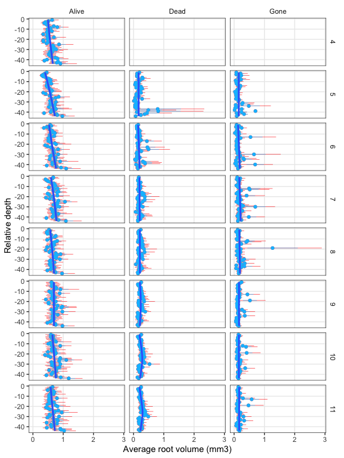
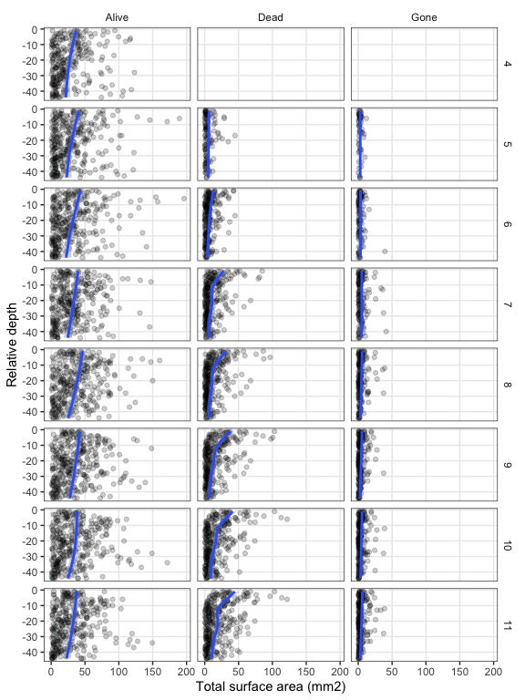

Root production and turnover
================

<!-- ## GitHub Documents -->
<!-- This is an R Markdown format used for publishing markdown documents to GitHub. When you click the **Knit** button all R code chunks are run and a markdown file (.md) suitable for publishing to GitHub is generated. -->

CW: use MR + models to get at dynamic rates with depth, and static cores
to get biomass/length with depth, then propagate them together to get
summed fluxes of production and turnover.

# Figures

1.  Length, Diameter, Production, Turnover by Depth

2.  Length, Diameter, Production, Turnover by Day of Year (Month)

## Number of roots across length bins

<!-- add diameter bins -->

<!-- --><!-- -->

<!-- --><!-- -->

## Individual roots

Plotted metrics by depth, month, and status

<!-- -->

<!-- -->

## Averaged individual root measurements

Root length, diameter, and volume by depth, month, and status.

Points are means, blue error bars are standard errors, red are 95% CI.
Both calculated using `stat_summary()` implementation. The line is the
fit from `geom_smooth(method = 'gam', formula = 'y ~ s(x, bs="cs)')`,
the default action in this case.

<!-- Add figure of medians, mode, explore using standard deviation -->

<!-- -->

<!-- -->

<!-- -->

# Root measures aggregated to depth (“location”)

The sum of each metric was calculated at each combination of Tube,
Location (depth), Month & Date (equivalent but keeping Date handy), and
root\_status.

In the plots, points are the sum values and lines are the fit from
`geom_smooth(method = 'gam', formula = 'y ~ s(x, bs="cs)')`, same as
above.

We have totals for:

-   root length (mm)
-   projected area (mm2)
-   surface area (mm2)
-   average diameter (cm)
-   volume (mm3)

<!-- -->

“It develops mid-section girth - a beer belly - over the season” -CW :)

<!-- -->

<!-- -->

<!-- -->

<!-- -->
