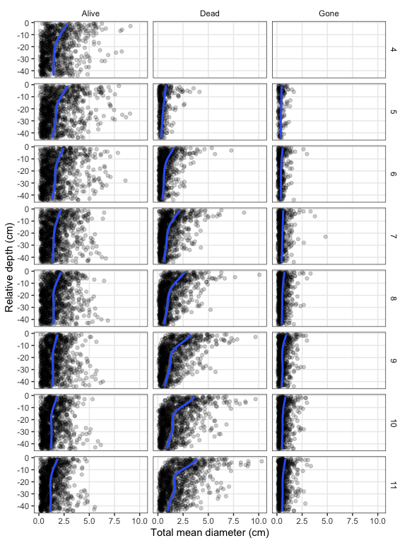
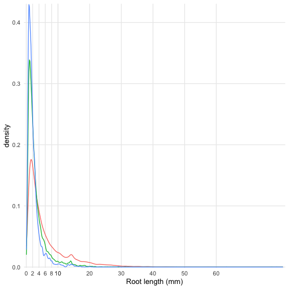

Root production and turnover
================

-   [Calculating Estimates of Root Production and
    Turnover](#calculating-estimates-of-root-production-and-turnover)
-   [Production and loss (change) of individual
    roots](#production-and-loss-change-of-individual-roots)
    -   [Sanity Check](#sanity-check)
-   [Modeling](#modeling)
    -   [Gross change](#gross-change)
    -   [Living roots (production)](#living-roots-production)
    -   [Root measurements aggregated to measurement depth
        (“Location”)](#root-measurements-aggregated-to-measurement-depth-location)
        -   [Models for roots measures aggregated to each
            depth](#models-for-roots-measures-aggregated-to-each-depth)
        -   [Models for roots aggregated to
            tubes](#models-for-roots-aggregated-to-tubes)
    -   [Number of roots across size
        bins](#number-of-roots-across-size-bins)
    -   [Individual roots](#individual-roots)
    -   [Averaged individual root
        measurements](#averaged-individual-root-measurements)

<!-- ## GitHub Documents -->
<!-- This is an R Markdown format used for publishing markdown documents to GitHub. When you click the **Knit** button all R code chunks are run and a markdown file (.md) suitable for publishing to GitHub is generated. -->

CW: use MR + models to get at dynamic rates with depth, and static cores
to get biomass/length with depth, then propagate them together to get
summed fluxes of production and turnover.

What changes happen in gross production and turnover?

Need to work on flagging zombies & wanderers

# Calculating Estimates of Root Production and Turnover

<!-- Milchunas (2009): "good agreement between pulse-isotope turnover and minirhizotron were obtained when minirhizotron estimates were *calculated from regression of decomposition versus production to equilibrium* and when pulse-isotope turnover estimates were calculated from two-phase life-span  regressions." -->

Turnover = entering decomposition, sloughing of roots (“gone”);
deposition into the soil

-   individual present then gone (restrictive)
-   individual present but lost size (length and/or diameter; use
    volume? mass)

Split turnover into 2 parts

Alive –&gt; Dead = senescence Alive or Dead –&gt; Gone = turnover
(decomposition)

Alive to gone = senescence + turnover? (but wanderers)

or

Force “dead” before it can be “gone” for turnover definition? Stronger
confidence that it is truly gone into decomposition and turnover rather
than wanderer.

We can infer that “Gone” roots reappearing as “Alive” later were “Alive”
in between observations, but what about the hidden wanderers, those that
haven’t reappeared yet? (Have yet to take any action related to this;
all observations are treated as-is)

Rate/ratio of alive to dead at time t or time t to time t-1

Rate of production of “alive” roots

***New production & new loss for each root, then aggregate to the
frame***

Calculate gross change for individual roots in length, diameter, and
volume between each time step, for alive, dead, gone. The change values
can then be aggregated to the depth window.

-   flag completely new and totally gone?

Balogianni et al. (2016): “**Root production** was defined as the sum of
the length of new roots formed and any increase in length of existing
roots since the previous sampling day (Johnson et al. 2001). **Root
mortality** was defined as the sum of the length of roots that had
disappeared and any decrease in length of existing roots since the
previous sampling day. Root production and mortality for each interval
was expressed as the average meters of root length that appeared or
disappeared per square meter image area per day (m m−2 days−1) in each
tube.”

Number of new root IDs since initiation in April

April roots: 5409

New roots: 8916

That’s more new root IDs than I thought there would be.

<!-- ## Analyzing individual roots -->
<!-- Rate of appearance in dead and gone column of individual roots -->
<!-- Individual roots days to senescence (dead) or turnover (gone) -->
<!-- Kaplan-Meier or Cox proportional hazard regression -->
<!-- - days to event (senescence or turnover) for individual roots -->
<!-- - 30-day step -->
<!-- Kaplan-Meier: estimate median survivorship/longevity of individual or cohort. "Censoring" for alive/dead - roots still alive at end of period results in underestimates longevity. -->
<!-- Cox: estimate "death hazard" at any given time in relation to other covariates -->

1.  Length, Diameter, Production, Turnover by Depth

2.  Length, Diameter, Production, Turnover by Day of Year (Month)

<!-- Size (diameter) & depth biplot of days to senescence -->

# Production and loss (change) of individual roots

Calculate gross change for individual roots in length, diameter, and
volume between each time step, for alive, dead, gone. The change values
can then be aggregated to the depth window.

<!-- CW: I think the main change is that we need to separate out the gains and losses. So, ind_gain_sum should actually be split into gross gain and gross loss. Then, the next step is to add new roots into the gross gain, and add newly dead or gone roots to the gross loss. -->
<!-- After doing that, we aggregate to each depth window, but now have gross production and gross turnover by window. -->
<!-- Is "gross loss" then the sum of 'Dead', 'Gone' and negative values of 'Alive'? -->

**Gross Gain** = growth of existing roots + new roots

**Gross Loss** = loss of existing roots + dead roots + gone roots

    ##       Tube         Location         Month            name          
    ##  Min.   : 1.0   Min.   : 1.00   Min.   : 5.000   Length:16252      
    ##  1st Qu.: 7.0   1st Qu.:10.00   1st Qu.: 6.000   Class :character  
    ##  Median :12.0   Median :21.00   Median : 8.000   Mode  :character  
    ##  Mean   :12.4   Mean   :21.39   Mean   : 8.039                     
    ##  3rd Qu.:18.0   3rd Qu.:32.00   3rd Qu.:10.000                     
    ##  Max.   :24.0   Max.   :44.00   Max.   :11.000                     
    ##   treatment          root_growth         new_roots           gross_gain      
    ##  Length:16252       Min.   : 0.00000   Min.   :  0.00000   Min.   :  0.0000  
    ##  Class :character   1st Qu.: 0.00000   1st Qu.:  0.00000   1st Qu.:  0.0327  
    ##  Mode  :character   Median : 0.04447   Median :  0.04245   Median :  0.3885  
    ##                     Mean   : 1.20122   Mean   :  2.21664   Mean   :  3.4179  
    ##                     3rd Qu.: 0.61790   3rd Qu.:  0.82409   3rd Qu.:  2.0940  
    ##                     Max.   :55.05780   Max.   :191.70910   Max.   :195.5022

    ##       Tube          Location         Month            name          
    ##  Min.   : 1.00   Min.   : 1.00   Min.   : 5.000   Length:11631      
    ##  1st Qu.: 7.00   1st Qu.: 8.00   1st Qu.: 6.000   Class :character  
    ##  Median :12.00   Median :19.00   Median : 8.000   Mode  :character  
    ##  Mean   :12.57   Mean   :19.82   Mean   : 7.988                     
    ##  3rd Qu.:18.00   3rd Qu.:30.00   3rd Qu.:10.000                     
    ##  Max.   :24.00   Max.   :44.00   Max.   :11.000                     
    ##   treatment            dg_roots         root_loss         gross_loss      
    ##  Length:11631       Min.   : 0.0012   Min.   : 0.0000   Min.   :  0.0012  
    ##  Class :character   1st Qu.: 0.2394   1st Qu.: 0.0000   1st Qu.:  0.3794  
    ##  Mode  :character   Median : 0.6838   Median : 0.1005   Median :  1.0077  
    ##                     Mean   : 3.2679   Mean   : 1.8155   Mean   :  5.0834  
    ##                     3rd Qu.: 2.7424   3rd Qu.: 1.2393   3rd Qu.:  5.2317  
    ##                     Max.   :94.6837   Max.   :63.2020   Max.   :140.3168

Figure of gross gain and gross loss aggregated to depth window.

<!-- -->

Compare calculated gross change (gain - loss) from T1 to
T2 to the observed total at T2 of root length for
each window.

### Sanity Check

    ## # A tibble: 7,485 x 8
    ##     Tube Location Month treatment TotLength_mm gross_gain gross_loss calc_net
    ##    <dbl>    <dbl> <dbl> <chr>            <dbl>      <dbl>      <dbl>    <dbl>
    ##  1     1        1     4 control           23.2      NA         NA        NA  
    ##  2     1        1     5 control           11.3      NA         NA        NA  
    ##  3     1        1     6 control           62.3      37.7        1.78     47.2
    ##  4     1        1     7 control           76.2      37.9       24.0      76.2
    ##  5     1        1     8 control           67.1       9.61      13.8      72.1
    ##  6     1        1     9 control           36.6      11.6       53.6      25.2
    ##  7     1        1    10 control           65.6       9.52      23.3      22.8
    ##  8     1        1    11 control           77.7      18.6        6.40     77.7
    ##  9     1        2     4 control           27.0      NA         NA        NA  
    ## 10     1        2     5 control           54.0      42.8       15.7      54.0
    ## # … with 7,475 more rows

<!-- -->

    ## [1] 0.9977984

# Modeling

## Gross change

<!-- -->

    ## Linear mixed model fit by REML ['lmerMod']
    ## Formula: gl_sum ~ clipped + clipped:manure + (1 | Location) + (1 | Tube)
    ##    Data: d
    ## 
    ## REML criterion at convergence: 10162.3
    ## 
    ## Scaled residuals: 
    ##     Min      1Q  Median      3Q     Max 
    ## -3.3418 -0.6145 -0.1949  0.4957  4.2912 
    ## 
    ## Random effects:
    ##  Groups   Name        Variance Std.Dev.
    ##  Location (Intercept)  275.7   16.60   
    ##  Tube     (Intercept)  743.7   27.27   
    ##  Residual             1237.5   35.18   
    ## Number of obs: 1007, groups:  Location, 44; Tube, 24
    ## 
    ## Fixed effects:
    ##                      Estimate Std. Error t value
    ## (Intercept)           44.8500    10.1518   4.418
    ## clippedyes            -5.0984    13.9091  -0.367
    ## clippedyes:manureyes   0.8722    13.9000   0.063
    ## 
    ## Correlation of Fixed Effects:
    ##             (Intr) clppdy
    ## clippedyes  -0.685       
    ## clppdys:mnr  0.000 -0.500
    ## fit warnings:
    ## fixed-effect model matrix is rank deficient so dropping 1 column / coefficient

    ## Linear mixed model fit by REML ['lmerMod']
    ## Formula: gg_sum ~ clipped + clipped:manure + (1 | Location) + (1 | Tube)
    ##    Data: d
    ## 
    ## REML criterion at convergence: 10207.8
    ## 
    ## Scaled residuals: 
    ##     Min      1Q  Median      3Q     Max 
    ## -3.8898 -0.6181 -0.1600  0.4757  5.2847 
    ## 
    ## Random effects:
    ##  Groups   Name        Variance Std.Dev.
    ##  Location (Intercept)  236.3   15.37   
    ##  Tube     (Intercept)  933.7   30.56   
    ##  Residual             1299.6   36.05   
    ## Number of obs: 1007, groups:  Location, 44; Tube, 24
    ## 
    ## Fixed effects:
    ##                      Estimate Std. Error t value
    ## (Intercept)            54.897     11.230   4.888
    ## clippedyes             -8.502     15.536  -0.547
    ## clippedyes:manureyes   -2.107     15.527  -0.136
    ## 
    ## Correlation of Fixed Effects:
    ##             (Intr) clppdy
    ## clippedyes  -0.692       
    ## clppdys:mnr  0.000 -0.500
    ## fit warnings:
    ## fixed-effect model matrix is rank deficient so dropping 1 column / coefficient

<!-- -->

## Living roots (production)

Our goal here is to grab at the “low-hanging fruit” using mixed-effects
regression models to evaluate treatment affects and additional
covariates. The response and explanatory variables are listed below. I
think one open question as we go through iterations of model development
is when to apply the (relative) depth as a continous explanatory factor
vs. a random intercept - the answer to this depends on the question
we’re trying to answer.

**Response variables - living roots**

-   (Average) length
-   (Average) volume
-   (Average) diameter

Finest resolution is individual roots. Aggregate (average) response
variables to:

-   Depth window (plot/tube/depth)
-   Depth class (e.g. 1-5 cm, 6-10 cm, etc.)
-   Tube (plot/tube)
-   Plot (plot)

**Explanatory covariates**

Plot level

-   Treatment (uncut, cut, cut + manure)
-   Composition (bahia, mixed)
-   LAI (leaf area index)
-   Soil moisture (VWC)
-   Soil temperature
-   Aboveground biomass
-   Sample month

Random effects (intercepts)

-   (1\|depth)
-   (1\|tube)
-   (1\|month/depth)

## Root measurements aggregated to measurement depth (“Location”)

The sum of each metric was calculated at each combination of Tube,
Location (depth), Month & Date (equivalent but keeping Date handy), and
root\_status.

In the plots, points are the sum values and lines are the fit from
`geom_smooth(method = 'gam', formula = 'y ~ s(x, bs="cs)')`.

We have totals for:

-   root length (mm)
-   projected area (mm2)
-   surface area (mm2)
-   average diameter (cm)
-   volume (mm3)

Depth is roughly 1 cm sections (1 cm x 1 cm minirhizotron image
windows).

<!-- -->

<!-- -->

<!-- -->

<!-- Are these surface area estimates of current interest? -->
<!-- I don't even know what "proj_area" is -->

### Models for roots measures aggregated to each depth

Depth is the observation unit.

I calculate maximum temperature, minimum temperature, and average
temperature for each month, so these metrics only roughly correspond to
the time around when the root images were taken. Ideally these
temperature values would be for the temperatures recorded between the t
and t-1 measurements (I’m being a little lazy on the first pass).

I do fit and compare separate models for the max, min, and average.
Hopefully I was consistent so that models with “d1” = max temp, “d2” =
min temp, and “d3” = avg temp.

The model pseudocode is:

`lmer(root metric ~ temperature metric + avg_vwc + clipped + clipped:manure + composition + (1 | depth) + (1 | Tube) + (1 | month_num), data = depth_model_data)`

<!-- #### Average root length  -->
<!-- Scratch this -->
<!-- All interpretations with a grain of salt given the less than ideal model diagnostic plots. -->
<!-- Some treatment effect from clipping and simulated grazing (clipping + manure) - clipping alone has shorter while simulated grazing has longer. -->

#### Summed root length

    ##            df      AIC
    ## len_tot_d1 11 70475.11
    ## len_tot_d2 11 70474.67
    ## len_tot_d3 11 70475.65

<!-- --><!-- -->

    ## Linear mixed model fit by REML ['lmerMod']
    ## Formula: tot_length_mm ~ max_temp + avg_vwc + clipped + clipped:manure +  
    ##     composition + (1 | depth) + (1 | block/Tube) + (1 | month_num)
    ##    Data: depth_model_data
    ## 
    ## REML criterion at convergence: 70453.1
    ## 
    ## Scaled residuals: 
    ##     Min      1Q  Median      3Q     Max 
    ## -3.8391 -0.6567 -0.1550  0.5139  6.3535 
    ## 
    ## Random effects:
    ##  Groups     Name        Variance Std.Dev.
    ##  depth      (Intercept)  22.59    4.753  
    ##  Tube:block (Intercept) 195.40   13.979  
    ##  block      (Intercept) 114.90   10.719  
    ##  month_num  (Intercept)  22.82    4.777  
    ##  Residual               698.57   26.431  
    ## Number of obs: 7485, groups:  depth, 44; Tube:block, 24; block, 8; month_num, 8
    ## 
    ## Fixed effects:
    ##                      Estimate Std. Error t value
    ## (Intercept)           66.1175    18.8436   3.509
    ## max_temp              -0.8555     0.6471  -1.322
    ## avg_vwc                0.1084     0.1854   0.585
    ## clippedyes            -6.6261     7.0371  -0.942
    ## compositionmixed     -10.1171     9.5159  -1.063
    ## clippedyes:manureyes   3.5596     7.0290   0.506
    ## 
    ## Correlation of Fixed Effects:
    ##             (Intr) mx_tmp avg_vw clppdy cmpstn
    ## max_temp    -0.899                            
    ## avg_vwc     -0.099  0.006                     
    ## clippedyes  -0.152 -0.040  0.013              
    ## compostnmxd -0.289  0.041 -0.003 -0.002       
    ## clppdys:mnr  0.001  0.000 -0.016 -0.500  0.000
    ## fit warnings:
    ## fixed-effect model matrix is rank deficient so dropping 1 column / coefficient

<!-- --><!-- --><!-- --><!-- -->

<!-- #### Average root length model with LAI -->

#### Summed root length model with LAI

Subset of data with no NA values for LAI.

Is LAI confounded with the “clipped” treatment? yes. Exclude treatment
from models with LAI

    ## Linear mixed model fit by REML ['lmerMod']
    ## Formula: tot_length_mm ~ max_temp + avg_vwc + avg_lai + composition +  
    ##     (1 | depth) + (1 | block/Tube) + (1 | month_num)
    ##    Data: depth_model_data
    ## 
    ## REML criterion at convergence: 44255.9
    ## 
    ## Scaled residuals: 
    ##     Min      1Q  Median      3Q     Max 
    ## -4.2117 -0.6642 -0.1406  0.5436  5.7533 
    ## 
    ## Random effects:
    ##  Groups     Name        Variance Std.Dev.
    ##  depth      (Intercept)  20.63    4.542  
    ##  Tube:block (Intercept) 240.95   15.523  
    ##  block      (Intercept)  84.85    9.212  
    ##  month_num  (Intercept) 100.57   10.029  
    ##  Residual               642.81   25.354  
    ## Number of obs: 4738, groups:  depth, 44; Tube:block, 24; block, 8; month_num, 5
    ## 
    ## Fixed effects:
    ##                  Estimate Std. Error t value
    ## (Intercept)      119.3925    27.2009   4.389
    ## max_temp          -2.8740     0.9708  -2.961
    ## avg_vwc            0.2587     0.2996   0.863
    ## avg_lai           -1.9751     0.7256  -2.722
    ## compositionmixed -11.4131     9.1534  -1.247
    ## 
    ## Correlation of Fixed Effects:
    ##             (Intr) mx_tmp avg_vw avg_la
    ## max_temp    -0.947                     
    ## avg_vwc     -0.167  0.043              
    ## avg_lai     -0.078  0.014  0.099       
    ## compostnmxd -0.216  0.057 -0.009 -0.067

<!-- --><!-- --><!-- --><!-- --><!-- -->

    ## Linear mixed model fit by REML ['lmerMod']
    ## Formula: tot_length_mm ~ max_temp + avg_vwc + LAI + composition + (1 |  
    ##     depth) + (1 | block/Tube) + (1 | month_num)
    ##    Data: depth_model_data
    ## 
    ## REML criterion at convergence: 53295.5
    ## 
    ## Scaled residuals: 
    ##     Min      1Q  Median      3Q     Max 
    ## -4.1956 -0.6560 -0.1495  0.5337  5.9983 
    ## 
    ## Random effects:
    ##  Groups     Name        Variance Std.Dev.
    ##  depth      (Intercept)  21.22    4.607  
    ##  Tube:block (Intercept) 198.38   14.085  
    ##  block      (Intercept)  94.51    9.722  
    ##  month_num  (Intercept) 179.16   13.385  
    ##  Residual               676.50   26.010  
    ## Number of obs: 5677, groups:  depth, 44; Tube:block, 24; block, 8; month_num, 6
    ## 
    ## Fixed effects:
    ##                  Estimate Std. Error t value
    ## (Intercept)      160.4895    25.4904   6.296
    ## max_temp          -4.7559     0.8869  -5.362
    ## avg_vwc            0.7266     0.2933   2.477
    ## LAI                0.3040     0.6159   0.494
    ## compositionmixed -14.1433     9.0174  -1.568
    ## 
    ## Correlation of Fixed Effects:
    ##             (Intr) mx_tmp avg_vw LAI   
    ## max_temp    -0.935                     
    ## avg_vwc     -0.206  0.086              
    ## LAI         -0.001 -0.046  0.008       
    ## compostnmxd -0.233  0.064  0.003 -0.050

<!-- -->

Pretty strong negative relationship with average LAI and maximum
temperature but not with nearest LAI value.

#### Average root diameter

    ##             df       AIC
    ## diam_avg_d2 11 -14004.73
    ## diam_avg_d1 11 -14004.63
    ## diam_avg_d3 11 -14004.40

<!-- --><!-- -->

    ## Linear mixed model fit by REML ['lmerMod']
    ## Formula: avg_diam_mm ~ min_temp + avg_vwc + clipped + clipped:manure +  
    ##     composition + (1 | depth) + (1 | block/Tube) + (1 | month_num)
    ##    Data: depth_model_data
    ## 
    ## REML criterion at convergence: -14026.7
    ## 
    ## Scaled residuals: 
    ##     Min      1Q  Median      3Q     Max 
    ## -2.3295 -0.5794 -0.1682  0.3577 10.8601 
    ## 
    ## Random effects:
    ##  Groups     Name        Variance  Std.Dev.
    ##  depth      (Intercept) 0.0001391 0.01179 
    ##  Tube:block (Intercept) 0.0004787 0.02188 
    ##  block      (Intercept) 0.0001697 0.01303 
    ##  month_num  (Intercept) 0.0003864 0.01966 
    ##  Residual               0.0087460 0.09352 
    ## Number of obs: 7485, groups:  depth, 44; Tube:block, 24; block, 8; month_num, 8
    ## 
    ## Fixed effects:
    ##                        Estimate Std. Error t value
    ## (Intercept)           0.3283063  0.0464871   7.062
    ## min_temp             -0.0026148  0.0018489  -1.414
    ## avg_vwc               0.0008900  0.0007049   1.263
    ## clippedyes           -0.0100478  0.0112760  -0.891
    ## compositionmixed      0.0345404  0.0130400   2.649
    ## clippedyes:manureyes  0.0011467  0.0112560   0.102
    ## 
    ## Correlation of Fixed Effects:
    ##             (Intr) mn_tmp avg_vw clppdy cmpstn
    ## min_temp    -0.947                            
    ## avg_vwc     -0.232  0.093                     
    ## clippedyes  -0.110 -0.017  0.029              
    ## compostnmxd -0.196  0.061 -0.004 -0.001       
    ## clppdys:mnr  0.020 -0.016 -0.039 -0.500  0.000
    ## fit warnings:
    ## fixed-effect model matrix is rank deficient so dropping 1 column / coefficient

<!-- --><!-- --><!-- --><!-- --><!-- --><!-- -->

Average root diameter is greater in the mixed versus the bahia-only
composition, indicating that peanut roots have larger diameters. The
scale of these coefficient estimates is super tiny - 100ths of
millimeters…maybe…could be units issue. But as long as any units issue
is simply scalar the relationships should be the same.

#### Average root diameter model with LAI

    ## Linear mixed model fit by REML ['lmerMod']
    ## Formula: avg_diam_mm ~ min_temp + avg_vwc + avg_lai + composition + (1 |  
    ##     depth) + (1 | block/Tube) + (1 | month_num)
    ##    Data: depth_lai_model_data
    ## 
    ## REML criterion at convergence: -9764
    ## 
    ## Scaled residuals: 
    ##     Min      1Q  Median      3Q     Max 
    ## -2.4215 -0.5968 -0.1713  0.3877 11.5400 
    ## 
    ## Random effects:
    ##  Groups     Name        Variance  Std.Dev.
    ##  depth      (Intercept) 0.0001093 0.01045 
    ##  Tube:block (Intercept) 0.0004131 0.02032 
    ##  block      (Intercept) 0.0002484 0.01576 
    ##  month_num  (Intercept) 0.0001261 0.01123 
    ##  Residual               0.0071998 0.08485 
    ## Number of obs: 4738, groups:  depth, 44; Tube:block, 24; block, 8; month_num, 5
    ## 
    ## Fixed effects:
    ##                    Estimate Std. Error t value
    ## (Intercept)       0.2419158  0.0349737   6.917
    ## min_temp          0.0009243  0.0013632   0.678
    ## avg_vwc           0.0002133  0.0005634   0.379
    ## avg_lai          -0.0021604  0.0018252  -1.184
    ## compositionmixed  0.0425786  0.0142100   2.996
    ## 
    ## Correlation of Fixed Effects:
    ##             (Intr) mn_tmp avg_vw avg_la
    ## min_temp    -0.925                     
    ## avg_vwc     -0.275  0.111              
    ## avg_lai      0.019 -0.125 -0.043       
    ## compostnmxd -0.231  0.046  0.002 -0.112

<!-- --><!-- --><!-- --><!-- --><!-- -->

    ## Linear mixed model fit by REML ['lmerMod']
    ## Formula: avg_diam_mm ~ min_temp + avg_vwc + LAI + composition + (1 | depth) +  
    ##     (1 | Tube) + (1 | month_num)
    ##    Data: depth_lai_model_data
    ## 
    ## REML criterion at convergence: -11420.4
    ## 
    ## Scaled residuals: 
    ##     Min      1Q  Median      3Q     Max 
    ## -2.4176 -0.5971 -0.1721  0.3783 11.1610 
    ## 
    ## Random effects:
    ##  Groups    Name        Variance  Std.Dev.
    ##  depth     (Intercept) 1.176e-04 0.010844
    ##  Tube      (Intercept) 5.469e-04 0.023386
    ##  month_num (Intercept) 9.535e-05 0.009765
    ##  Residual              7.592e-03 0.087133
    ## Number of obs: 5677, groups:  depth, 44; Tube, 24; month_num, 6
    ## 
    ## Fixed effects:
    ##                    Estimate Std. Error t value
    ## (Intercept)       2.399e-01  3.066e-02   7.824
    ## min_temp          1.032e-03  1.196e-03   0.863
    ## avg_vwc           3.733e-05  4.973e-04   0.075
    ## LAI              -1.643e-04  1.683e-03  -0.098
    ## compositionmixed  3.932e-02  9.906e-03   3.969
    ## 
    ## Correlation of Fixed Effects:
    ##             (Intr) mn_tmp avg_vw LAI   
    ## min_temp    -0.943                     
    ## avg_vwc     -0.274  0.105              
    ## LAI         -0.065 -0.033 -0.010       
    ## compostnmxd -0.193  0.049  0.003 -0.118

<!-- -->

A negative but very small value relationship with avg LAI; no
relationship with nearest LAI measurement.

<!-- #### Summed root diameter -->

#### Average root volume

    ##               df      AIC
    ## volume_avg_d3 11 20960.03
    ## volume_avg_d2 11 20960.21
    ## volume_avg_d1 11 20960.25

<!-- --><!-- -->

    ## Linear mixed model fit by REML ['lmerMod']
    ## Formula: avg_volume_mm3 ~ avg_temp + avg_vwc + clipped + clipped:manure +  
    ##     composition + (1 | depth) + (1 | block/Tube) + (1 | month_num)
    ##    Data: depth_model_data
    ## 
    ## REML criterion at convergence: 20938
    ## 
    ## Scaled residuals: 
    ##     Min      1Q  Median      3Q     Max 
    ## -1.3895 -0.5118 -0.2543  0.1668 16.6829 
    ## 
    ## Random effects:
    ##  Groups     Name        Variance Std.Dev.
    ##  depth      (Intercept) 0.016613 0.12889 
    ##  Tube:block (Intercept) 0.036425 0.19085 
    ##  block      (Intercept) 0.000000 0.00000 
    ##  month_num  (Intercept) 0.000273 0.01652 
    ##  Residual               0.941258 0.97018 
    ## Number of obs: 7485, groups:  depth, 44; Tube:block, 24; block, 8; month_num, 8
    ## 
    ## Fixed effects:
    ##                       Estimate Std. Error t value
    ## (Intercept)           0.574161   0.168182   3.414
    ## avg_temp              0.008134   0.005853   1.390
    ## avg_vwc               0.001119   0.001797   0.622
    ## clippedyes           -0.201077   0.099483  -2.021
    ## compositionmixed      0.163078   0.081179   2.009
    ## clippedyes:manureyes  0.130264   0.099197   1.313
    ## 
    ## Correlation of Fixed Effects:
    ##             (Intr) avg_tm avg_vw clppdy cmpstn
    ## avg_temp    -0.861                            
    ## avg_vwc     -0.072 -0.036                     
    ## clippedyes  -0.282 -0.019  0.013              
    ## compostnmxd -0.273  0.037 -0.006 -0.001       
    ## clppdys:mnr  0.002 -0.001 -0.013 -0.499  0.001
    ## fit warnings:
    ## fixed-effect model matrix is rank deficient so dropping 1 column / coefficient
    ## optimizer (nloptwrap) convergence code: 0 (OK)
    ## boundary (singular) fit: see ?isSingular

<!-- --><!-- --><!-- --><!-- --><!-- -->

    ## Linear mixed model fit by REML ['lmerMod']
    ## Formula: 
    ## avg_volume_mm3 ~ std2_avg_temp + std2_avg_vwc + clipped + clipped:manure +  
    ##     composition + (1 | depth) + (1 | block/Tube) + (1 | month_num)
    ##    Data: depth_model_data
    ## 
    ## REML criterion at convergence: 20929.8
    ## 
    ## Scaled residuals: 
    ##     Min      1Q  Median      3Q     Max 
    ## -1.3895 -0.5118 -0.2543  0.1668 16.6829 
    ## 
    ## Random effects:
    ##  Groups     Name        Variance Std.Dev.
    ##  depth      (Intercept) 0.016613 0.12889 
    ##  Tube:block (Intercept) 0.036425 0.19085 
    ##  block      (Intercept) 0.000000 0.00000 
    ##  month_num  (Intercept) 0.000273 0.01652 
    ##  Residual               0.941258 0.97018 
    ## Number of obs: 7485, groups:  depth, 44; Tube:block, 24; block, 8; month_num, 8
    ## 
    ## Fixed effects:
    ##                      Estimate Std. Error t value
    ## (Intercept)           0.78669    0.08383   9.384
    ## std2_avg_temp         0.03576    0.02573   1.390
    ## std2_avg_vwc          0.01593    0.02559   0.622
    ## clippedyes           -0.20108    0.09948  -2.021
    ## compositionmixed      0.16308    0.08118   2.009
    ## clippedyes:manureyes  0.13026    0.09920   1.313
    ## 
    ## Correlation of Fixed Effects:
    ##             (Intr) std2_vg_t std2_vg_v clppdy cmpstn
    ## std2_vg_tmp -0.002                                  
    ## std2_vg_vwc -0.002 -0.036                           
    ## clippedyes  -0.596 -0.019     0.013                 
    ## compostnmxd -0.484  0.037    -0.006    -0.001       
    ## clppdys:mnr -0.001 -0.001    -0.013    -0.499  0.001
    ## fit warnings:
    ## fixed-effect model matrix is rank deficient so dropping 1 column / coefficient
    ## optimizer (nloptwrap) convergence code: 0 (OK)
    ## boundary (singular) fit: see ?isSingular

<!-- -->

Lower average volume in clipped but higher average volume in mixed
composition. The mean point estimate for simulated grazing is solidly on
the positive side.

#### Average root volume model with LAI

<!-- -->

    ## Linear mixed model fit by REML ['lmerMod']
    ## Formula: avg_volume_mm3 ~ avg_temp + avg_vwc + avg_lai + composition +  
    ##     (1 | depth) + (1 | block/Tube) + (1 | month_num)
    ##    Data: depth_lai_model_data
    ## 
    ## REML criterion at convergence: 12849.9
    ## 
    ## Scaled residuals: 
    ##     Min      1Q  Median      3Q     Max 
    ## -1.2692 -0.5259 -0.2584  0.1877 13.4760 
    ## 
    ## Random effects:
    ##  Groups     Name        Variance Std.Dev.
    ##  depth      (Intercept) 0.014172 0.11905 
    ##  Tube:block (Intercept) 0.047249 0.21737 
    ##  block      (Intercept) 0.000000 0.00000 
    ##  month_num  (Intercept) 0.001494 0.03865 
    ##  Residual               0.857380 0.92595 
    ## Number of obs: 4738, groups:  depth, 44; Tube:block, 24; block, 8; month_num, 5
    ## 
    ## Fixed effects:
    ##                   Estimate Std. Error t value
    ## (Intercept)       0.538597   0.221117   2.436
    ## avg_temp          0.006849   0.008455   0.810
    ## avg_vwc           0.001146   0.002694   0.426
    ## avg_lai          -0.016256   0.019444  -0.836
    ## compositionmixed  0.197482   0.094405   2.092
    ## 
    ## Correlation of Fixed Effects:
    ##             (Intr) avg_tm avg_vw avg_la
    ## avg_temp    -0.927                     
    ## avg_vwc     -0.151  0.051              
    ## avg_lai      0.046 -0.206 -0.182       
    ## compostnmxd -0.251  0.076  0.029 -0.181
    ## optimizer (nloptwrap) convergence code: 0 (OK)
    ## boundary (singular) fit: see ?isSingular

<!-- --><!-- --><!-- --><!-- --><!-- -->

    ## Linear mixed model fit by REML ['lmerMod']
    ## Formula: avg_volume_mm3 ~ avg_temp + avg_vwc + LAI + composition + (1 |  
    ##     depth) + (1 | block/Tube) + (1 | month_num)
    ##    Data: depth_lai_model_data
    ## 
    ## REML criterion at convergence: 15679.7
    ## 
    ## Scaled residuals: 
    ##     Min      1Q  Median      3Q     Max 
    ## -1.2713 -0.5207 -0.2618  0.1838 15.3066 
    ## 
    ## Random effects:
    ##  Groups     Name        Variance  Std.Dev.
    ##  depth      (Intercept) 0.0149665 0.1223  
    ##  Tube:block (Intercept) 0.0399472 0.1999  
    ##  block      (Intercept) 0.0000000 0.0000  
    ##  month_num  (Intercept) 0.0004972 0.0223  
    ##  Residual               0.9047528 0.9512  
    ## Number of obs: 5677, groups:  depth, 44; Tube:block, 24; block, 8; month_num, 6
    ## 
    ## Fixed effects:
    ##                   Estimate Std. Error t value
    ## (Intercept)      0.5119402  0.1772227   2.889
    ## avg_temp         0.0065548  0.0064056   1.023
    ## avg_vwc          0.0004224  0.0020681   0.204
    ## LAI              0.0084534  0.0162931   0.519
    ## compositionmixed 0.1696507  0.0862440   1.967
    ## 
    ## Correlation of Fixed Effects:
    ##             (Intr) avg_tm avg_vw LAI   
    ## avg_temp    -0.910                     
    ## avg_vwc     -0.147  0.022              
    ## LAI         -0.138 -0.027 -0.002       
    ## compostnmxd -0.252  0.038  0.000 -0.131
    ## optimizer (nloptwrap) convergence code: 0 (OK)
    ## boundary (singular) fit: see ?isSingular

<!-- -->

No effect of average or nearest LAI.

#### Summed root volume

    ##               df      AIC
    ## volume_tot_d3 11 41587.67
    ## volume_tot_d2 11 41588.69
    ## volume_tot_d1 11 41589.21

<!-- --><!-- -->

    ## Linear mixed model fit by REML ['lmerMod']
    ## Formula: tot_volume_mm3 ~ avg_temp + avg_vwc + clipped + clipped:manure +  
    ##     composition + (1 | depth) + (1 | block/Tube) + (1 | month_num)
    ##    Data: depth_model_data
    ## 
    ## REML criterion at convergence: 41565.7
    ## 
    ## Scaled residuals: 
    ##     Min      1Q  Median      3Q     Max 
    ## -2.3792 -0.5925 -0.2585  0.3385  9.1966 
    ## 
    ## Random effects:
    ##  Groups     Name        Variance Std.Dev.
    ##  depth      (Intercept)  0.46396 0.6811  
    ##  Tube:block (Intercept)  1.48775 1.2197  
    ##  block      (Intercept)  0.69871 0.8359  
    ##  month_num  (Intercept)  0.03405 0.1845  
    ##  Residual               14.74861 3.8404  
    ## Number of obs: 7485, groups:  depth, 44; Tube:block, 24; block, 8; month_num, 8
    ## 
    ## Fixed effects:
    ##                       Estimate Std. Error t value
    ## (Intercept)           2.272230   1.121826   2.025
    ## avg_temp              0.082044   0.036168   2.268
    ## avg_vwc               0.005712   0.011016   0.519
    ## clippedyes           -1.265426   0.620029  -2.041
    ## compositionmixed     -0.108201   0.778265  -0.139
    ## clippedyes:manureyes  0.652144   0.619247   1.053
    ## 
    ## Correlation of Fixed Effects:
    ##             (Intr) avg_tm avg_vw clppdy cmpstn
    ## avg_temp    -0.798                            
    ## avg_vwc     -0.068 -0.032                     
    ## clippedyes  -0.263 -0.018  0.011              
    ## compostnmxd -0.366  0.025 -0.004 -0.001       
    ## clppdys:mnr  0.002 -0.002 -0.011 -0.500  0.000
    ## fit warnings:
    ## fixed-effect model matrix is rank deficient so dropping 1 column / coefficient

<!-- -->

    ## [[1]]

<!-- -->

    ## 
    ## [[2]]

<!-- -->

    ## 
    ## [[3]]

<!-- -->

    ## 
    ## [[4]]

<!-- -->

    ## Linear mixed model fit by REML ['lmerMod']
    ## Formula: tot_volume_mm3 ~ avg_temp + avg_vwc + avg_lai + composition +  
    ##     (1 | depth) + (1 | block/Tube) + (1 | month_num)
    ##    Data: depth_lai_model_data
    ## 
    ## REML criterion at convergence: 26035.4
    ## 
    ## Scaled residuals: 
    ##     Min      1Q  Median      3Q     Max 
    ## -2.6386 -0.5921 -0.2479  0.3377  9.6454 
    ## 
    ## Random effects:
    ##  Groups     Name        Variance Std.Dev.
    ##  depth      (Intercept)  0.3984  0.6312  
    ##  Tube:block (Intercept)  2.4603  1.5685  
    ##  block      (Intercept)  0.5429  0.7368  
    ##  month_num  (Intercept)  0.0000  0.0000  
    ##  Residual               13.7787  3.7120  
    ## Number of obs: 4738, groups:  depth, 44; Tube:block, 24; block, 8; month_num, 5
    ## 
    ## Fixed effects:
    ##                   Estimate Std. Error t value
    ## (Intercept)       1.234923   0.796979   1.550
    ## avg_temp          0.108246   0.022635   4.782
    ## avg_vwc           0.011206   0.007094   1.580
    ## avg_lai          -0.176054   0.096765  -1.819
    ## compositionmixed -0.048195   0.837036  -0.058
    ## 
    ## Correlation of Fixed Effects:
    ##             (Intr) avg_tm avg_vw avg_la
    ## avg_temp    -0.629                     
    ## avg_vwc     -0.124  0.161              
    ## avg_lai      0.079 -0.401 -0.367       
    ## compostnmxd -0.534  0.049  0.036 -0.102
    ## optimizer (nloptwrap) convergence code: 0 (OK)
    ## boundary (singular) fit: see ?isSingular

<!-- --><!-- -->

    ## Linear mixed model fit by REML ['lmerMod']
    ## Formula: tot_volume_mm3 ~ avg_temp + avg_vwc + LAI + composition + (1 |  
    ##     depth) + (1 | block/Tube) + (1 | month_num)
    ##    Data: depth_lai_model_data
    ## 
    ## REML criterion at convergence: 31406.8
    ## 
    ## Scaled residuals: 
    ##     Min      1Q  Median      3Q     Max 
    ## -2.6790 -0.5879 -0.2460  0.3368  9.5222 
    ## 
    ## Random effects:
    ##  Groups     Name        Variance Std.Dev.
    ##  depth      (Intercept)  0.4192  0.6474  
    ##  Tube:block (Intercept)  1.8010  1.3420  
    ##  block      (Intercept)  0.6691  0.8180  
    ##  month_num  (Intercept)  5.6644  2.3800  
    ##  Residual               14.3160  3.7837  
    ## Number of obs: 5677, groups:  depth, 44; Tube:block, 24; block, 8; month_num, 6
    ## 
    ## Fixed effects:
    ##                  Estimate Std. Error t value
    ## (Intercept)      20.49831    4.82021   4.253
    ## avg_temp         -0.70682    0.18200  -3.884
    ## avg_vwc           0.09632    0.04383   2.198
    ## LAI               0.02852    0.08117   0.351
    ## compositionmixed -0.65308    0.81123  -0.805
    ## 
    ## Correlation of Fixed Effects:
    ##             (Intr) avg_tm avg_vw LAI   
    ## avg_temp    -0.967                     
    ## avg_vwc     -0.253  0.161              
    ## LAI          0.017 -0.048 -0.006       
    ## compostnmxd -0.199  0.124  0.016 -0.075

<!-- -->

Negative relationship between average LAI and total root volume; no
relationship with nearest LAI value.

<!-- Next step: Total root volume/length to nearest LAI acquisition date -  -->

Potential lag between LAI measurement to root production, or vice versa.

### Models for roots aggregated to tubes

The MR tube is the observation level.

If I understood the experiment and MR tube setup then each tube is the
same as a plot.

Model pseudo-code:

`lmer(root metric ~ temperature metric + avg_vwc + clipped + clipped:manure + composition + (1|block/Tube) + (1|month_num), data = tube_model_data)`

In coming back to this I noticed I used block in the random effect here
but not in the depth models…

#### Average root length

    ##            df      AIC
    ## len_avg_m1 10 482.6484
    ## len_avg_m3 10 482.7069
    ## len_avg_m2 10 483.3816

<!-- --><!-- -->

    ## Linear mixed model fit by REML ['lmerMod']
    ## Formula: avg_length_mm ~ max_temp + avg_vwc + clipped + clipped:manure +  
    ##     composition + (1 | block/Tube) + (1 | month_num)
    ##    Data: tube_model_data
    ## 
    ## REML criterion at convergence: 462.6
    ## 
    ## Scaled residuals: 
    ##     Min      1Q  Median      3Q     Max 
    ## -6.6513 -0.4218 -0.0024  0.4214  4.2732 
    ## 
    ## Random effects:
    ##  Groups     Name        Variance Std.Dev.
    ##  Tube:block (Intercept) 0.29818  0.5461  
    ##  block      (Intercept) 0.02422  0.1556  
    ##  month_num  (Intercept) 0.43598  0.6603  
    ##  Residual               0.42898  0.6550  
    ## Number of obs: 194, groups:  Tube:block, 24; block, 8; month_num, 8
    ## 
    ## Fixed effects:
    ##                      Estimate Std. Error t value
    ## (Intercept)           5.71336    2.51054   2.276
    ## max_temp              0.02648    0.09434   0.281
    ## avg_vwc               0.03714    0.02627   1.414
    ## clippedyes           -0.80125    0.29946  -2.676
    ## compositionmixed     -0.05450    0.27182  -0.201
    ## clippedyes:manureyes  0.44274    0.29675   1.492
    ## 
    ## Correlation of Fixed Effects:
    ##             (Intr) mx_tmp avg_vw clppdy cmpstn
    ## max_temp    -0.985                            
    ## avg_vwc     -0.128  0.029                     
    ## clippedyes   0.070 -0.136  0.043              
    ## compostnmxd -0.253  0.206 -0.014 -0.031       
    ## clppdys:mnr  0.008 -0.003 -0.055 -0.495  0.002
    ## fit warnings:
    ## fixed-effect model matrix is rank deficient so dropping 1 column / coefficient

<!-- --><!-- --><!-- --><!-- --><!-- -->

Aggregating up to the tube level tidies up the diagnostic plots in most
cases.

Negative effect of clipping - shorter roots.

#### Average root length model with LAI

    ## Linear mixed model fit by REML ['lmerMod']
    ## Formula: avg_length_mm ~ max_temp + avg_vwc + avg_lai + composition +  
    ##     (1 | block/Tube) + (1 | month_num)
    ##    Data: tube_lai_model_data
    ## 
    ## REML criterion at convergence: 319.4
    ## 
    ## Scaled residuals: 
    ##     Min      1Q  Median      3Q     Max 
    ## -5.8937 -0.3526  0.0745  0.3408  3.8631 
    ## 
    ## Random effects:
    ##  Groups     Name        Variance Std.Dev.
    ##  Tube:block (Intercept) 0.27007  0.5197  
    ##  block      (Intercept) 0.05703  0.2388  
    ##  month_num  (Intercept) 0.00000  0.0000  
    ##  Residual               0.52232  0.7227  
    ## Number of obs: 124, groups:  Tube:block, 24; block, 8; month_num, 5
    ## 
    ## Fixed effects:
    ##                   Estimate Std. Error t value
    ## (Intercept)       8.703486   0.974172   8.934
    ## max_temp         -0.084796   0.036071  -2.351
    ## avg_vwc           0.007646   0.008298   0.921
    ## avg_lai           0.149902   0.063098   2.376
    ## compositionmixed -0.244656   0.306761  -0.798
    ## 
    ## Correlation of Fixed Effects:
    ##             (Intr) mx_tmp avg_vw avg_la
    ## max_temp    -0.966                     
    ## avg_vwc     -0.158  0.097              
    ## avg_lai      0.058 -0.169 -0.225       
    ## compostnmxd -0.218  0.090  0.038 -0.187
    ## optimizer (nloptwrap) convergence code: 0 (OK)
    ## boundary (singular) fit: see ?isSingular

<!-- --><!-- --><!-- --><!-- -->

Positive relationship between root length and LAI. Negative relationship
with maximum temperature.

<!-- #### Summed root length -->
<!-- #### Summed root length model with LAI -->

#### Average root volume

    ##            df       AIC
    ## vol_avg_m1 10 -63.70242
    ## vol_avg_m3 10 -63.00374
    ## vol_avg_m2 10 -62.38298

<!-- --><!-- -->

    ## Linear mixed model fit by REML ['lmerMod']
    ## Formula: avg_volume_mm3 ~ max_temp + avg_vwc + clipped + clipped:manure +  
    ##     composition + (1 | block/Tube) + (1 | month_num)
    ##    Data: tube_model_data
    ## 
    ## REML criterion at convergence: -83.7
    ## 
    ## Scaled residuals: 
    ##     Min      1Q  Median      3Q     Max 
    ## -2.7729 -0.4288 -0.0205  0.4426  4.5051 
    ## 
    ## Random effects:
    ##  Groups     Name        Variance Std.Dev.
    ##  Tube:block (Intercept) 0.016834 0.12974 
    ##  block      (Intercept) 0.004055 0.06368 
    ##  month_num  (Intercept) 0.001224 0.03498 
    ##  Residual               0.025079 0.15836 
    ## Number of obs: 194, groups:  Tube:block, 24; block, 8; month_num, 8
    ## 
    ## Fixed effects:
    ##                       Estimate Std. Error t value
    ## (Intercept)           0.777197   0.280566   2.770
    ## max_temp             -0.003616   0.010371  -0.349
    ## avg_vwc               0.004109   0.002384   1.724
    ## clippedyes           -0.215479   0.070749  -3.046
    ## compositionmixed      0.111655   0.073423   1.521
    ## clippedyes:manureyes  0.104294   0.070606   1.477
    ## 
    ## Correlation of Fixed Effects:
    ##             (Intr) mx_tmp avg_vw clppdy cmpstn
    ## max_temp    -0.968                            
    ## avg_vwc     -0.082  0.001                     
    ## clippedyes  -0.068 -0.062  0.020              
    ## compostnmxd -0.209  0.083 -0.009 -0.007       
    ## clppdys:mnr  0.002  0.000 -0.023 -0.498  0.002
    ## fit warnings:
    ## fixed-effect model matrix is rank deficient so dropping 1 column / coefficient

<!-- --><!-- --><!-- --><!-- --><!-- -->

Negative effect of clipping, positive direction for simulated grazing
and soil moisture (standardized).

#### Average root volume model with LAI

    ## Linear mixed model fit by REML ['lmerMod']
    ## Formula: avg_volume_mm3 ~ max_temp + avg_vwc + avg_lai + composition +  
    ##     (1 | block/Tube) + (1 | month_num)
    ##    Data: tube_model_data
    ## 
    ## REML criterion at convergence: -35.2
    ## 
    ## Scaled residuals: 
    ##     Min      1Q  Median      3Q     Max 
    ## -2.7437 -0.4012 -0.0355  0.3573  4.8961 
    ## 
    ## Random effects:
    ##  Groups     Name        Variance  Std.Dev.
    ##  Tube:block (Intercept) 2.565e-02 0.160157
    ##  block      (Intercept) 4.060e-03 0.063719
    ##  month_num  (Intercept) 1.698e-05 0.004121
    ##  Residual               2.399e-02 0.154885
    ## Number of obs: 124, groups:  Tube:block, 24; block, 8; month_num, 5
    ## 
    ## Fixed effects:
    ##                   Estimate Std. Error t value
    ## (Intercept)       0.775792   0.214422   3.618
    ## max_temp         -0.007015   0.007881  -0.890
    ## avg_vwc           0.001268   0.001815   0.698
    ## avg_lai           0.011879   0.016617   0.715
    ## compositionmixed  0.118827   0.085630   1.388
    ## 
    ## Correlation of Fixed Effects:
    ##             (Intr) mx_tmp avg_vw avg_la
    ## max_temp    -0.948                     
    ## avg_vwc     -0.162  0.115              
    ## avg_lai      0.085 -0.220 -0.267       
    ## compostnmxd -0.251  0.084  0.044 -0.178

<!-- --><!-- --><!-- --><!-- -->

No effect of LAI.

#### Summed root volume

    ##            df      AIC
    ## vol_tot_m3 10 2064.479
    ## vol_tot_m2 10 2065.683
    ## vol_tot_m1  9 2071.571

    ## Linear mixed model fit by REML ['lmerMod']
    ## Formula: tot_volume_mm3 ~ avg_temp + avg_vwc + clipped + clipped:manure +  
    ##     composition + (1 | block/Tube) + (1 | month_num)
    ##    Data: tube_model_data
    ## 
    ## REML criterion at convergence: 2044.5
    ## 
    ## Scaled residuals: 
    ##     Min      1Q  Median      3Q     Max 
    ## -4.8450 -0.3256  0.0183  0.5258  2.5090 
    ## 
    ## Random effects:
    ##  Groups     Name        Variance Std.Dev.
    ##  Tube:block (Intercept) 2623.11  51.216  
    ##  block      (Intercept) 2166.81  46.549  
    ##  month_num  (Intercept)   78.28   8.848  
    ##  Residual               1886.42  43.433  
    ## Number of obs: 194, groups:  Tube:block, 24; block, 8; month_num, 8
    ## 
    ## Fixed effects:
    ##                      Estimate Std. Error t value
    ## (Intercept)           94.9244    60.2770   1.575
    ## avg_temp               2.7042     2.0453   1.322
    ## avg_vwc                0.3435     0.6298   0.545
    ## clippedyes           -45.5589    26.7336  -1.704
    ## compositionmixed      -2.6878    39.5097  -0.068
    ## clippedyes:manureyes  36.3156    26.7247   1.359
    ## 
    ## Correlation of Fixed Effects:
    ##             (Intr) avg_tm avg_vw clppdy cmpstn
    ## avg_temp    -0.841                            
    ## avg_vwc     -0.072 -0.032                     
    ## clippedyes  -0.204 -0.023  0.015              
    ## compostnmxd -0.351  0.028 -0.005 -0.001       
    ## clppdys:mnr  0.003 -0.002 -0.016 -0.499  0.001
    ## fit warnings:
    ## fixed-effect model matrix is rank deficient so dropping 1 column / coefficient

<!-- --><!-- --><!-- -->
<table style="border-collapse:collapse; border:none;">
<tr>
<th style="border-top: double; text-align:center; font-style:normal; font-weight:bold; padding:0.2cm;  text-align:left; ">
 
</th>
<th colspan="3" style="border-top: double; text-align:center; font-style:normal; font-weight:bold; padding:0.2cm; ">
tot\_volume\_mm3
</th>
</tr>
<tr>
<td style=" text-align:center; border-bottom:1px solid; font-style:italic; font-weight:normal;  text-align:left; ">
Predictors
</td>
<td style=" text-align:center; border-bottom:1px solid; font-style:italic; font-weight:normal;  ">
Estimates
</td>
<td style=" text-align:center; border-bottom:1px solid; font-style:italic; font-weight:normal;  ">
CI
</td>
<td style=" text-align:center; border-bottom:1px solid; font-style:italic; font-weight:normal;  ">
p
</td>
</tr>
<tr>
<td style=" padding:0.2cm; text-align:left; vertical-align:top; text-align:left; ">
(Intercept)
</td>
<td style=" padding:0.2cm; text-align:left; vertical-align:top; text-align:center;  ">
94.92
</td>
<td style=" padding:0.2cm; text-align:left; vertical-align:top; text-align:center;  ">
-23.22 – 213.07
</td>
<td style=" padding:0.2cm; text-align:left; vertical-align:top; text-align:center;  ">
0.115
</td>
</tr>
<tr>
<td style=" padding:0.2cm; text-align:left; vertical-align:top; text-align:left; ">
avg\_temp
</td>
<td style=" padding:0.2cm; text-align:left; vertical-align:top; text-align:center;  ">
2.70
</td>
<td style=" padding:0.2cm; text-align:left; vertical-align:top; text-align:center;  ">
-1.30 – 6.71
</td>
<td style=" padding:0.2cm; text-align:left; vertical-align:top; text-align:center;  ">
0.186
</td>
</tr>
<tr>
<td style=" padding:0.2cm; text-align:left; vertical-align:top; text-align:left; ">
avg\_vwc
</td>
<td style=" padding:0.2cm; text-align:left; vertical-align:top; text-align:center;  ">
0.34
</td>
<td style=" padding:0.2cm; text-align:left; vertical-align:top; text-align:center;  ">
-0.89 – 1.58
</td>
<td style=" padding:0.2cm; text-align:left; vertical-align:top; text-align:center;  ">
0.585
</td>
</tr>
<tr>
<td style=" padding:0.2cm; text-align:left; vertical-align:top; text-align:left; ">
clipped \[yes\]
</td>
<td style=" padding:0.2cm; text-align:left; vertical-align:top; text-align:center;  ">
-45.56
</td>
<td style=" padding:0.2cm; text-align:left; vertical-align:top; text-align:center;  ">
-97.96 – 6.84
</td>
<td style=" padding:0.2cm; text-align:left; vertical-align:top; text-align:center;  ">
0.088
</td>
</tr>
<tr>
<td style=" padding:0.2cm; text-align:left; vertical-align:top; text-align:left; ">
composition \[mixed\]
</td>
<td style=" padding:0.2cm; text-align:left; vertical-align:top; text-align:center;  ">
-2.69
</td>
<td style=" padding:0.2cm; text-align:left; vertical-align:top; text-align:center;  ">
-80.13 – 74.75
</td>
<td style=" padding:0.2cm; text-align:left; vertical-align:top; text-align:center;  ">
0.946
</td>
</tr>
<tr>
<td style=" padding:0.2cm; text-align:left; vertical-align:top; text-align:left; ">
clipped \[yes\] \* manureyes
</td>
<td style=" padding:0.2cm; text-align:left; vertical-align:top; text-align:center;  ">
36.32
</td>
<td style=" padding:0.2cm; text-align:left; vertical-align:top; text-align:center;  ">
-16.06 – 88.70
</td>
<td style=" padding:0.2cm; text-align:left; vertical-align:top; text-align:center;  ">
0.174
</td>
</tr>
<tr>
<td colspan="4" style="font-weight:bold; text-align:left; padding-top:.8em;">
Random Effects
</td>
</tr>
<tr>
<td style=" padding:0.2cm; text-align:left; vertical-align:top; text-align:left; padding-top:0.1cm; padding-bottom:0.1cm;">
σ2
</td>
<td style=" padding:0.2cm; text-align:left; vertical-align:top; padding-top:0.1cm; padding-bottom:0.1cm; text-align:left;" colspan="3">
1886.42
</td>
<tr>
<td style=" padding:0.2cm; text-align:left; vertical-align:top; text-align:left; padding-top:0.1cm; padding-bottom:0.1cm;">
τ00 Tube:block
</td>
<td style=" padding:0.2cm; text-align:left; vertical-align:top; padding-top:0.1cm; padding-bottom:0.1cm; text-align:left;" colspan="3">
2623.11
</td>
<tr>
<td style=" padding:0.2cm; text-align:left; vertical-align:top; text-align:left; padding-top:0.1cm; padding-bottom:0.1cm;">
τ00 block
</td>
<td style=" padding:0.2cm; text-align:left; vertical-align:top; padding-top:0.1cm; padding-bottom:0.1cm; text-align:left;" colspan="3">
2166.81
</td>
<tr>
<td style=" padding:0.2cm; text-align:left; vertical-align:top; text-align:left; padding-top:0.1cm; padding-bottom:0.1cm;">
τ00 month\_num
</td>
<td style=" padding:0.2cm; text-align:left; vertical-align:top; padding-top:0.1cm; padding-bottom:0.1cm; text-align:left;" colspan="3">
78.28
</td>
<tr>
<td style=" padding:0.2cm; text-align:left; vertical-align:top; text-align:left; padding-top:0.1cm; padding-bottom:0.1cm;">
ICC
</td>
<td style=" padding:0.2cm; text-align:left; vertical-align:top; padding-top:0.1cm; padding-bottom:0.1cm; text-align:left;" colspan="3">
0.72
</td>
<tr>
<td style=" padding:0.2cm; text-align:left; vertical-align:top; text-align:left; padding-top:0.1cm; padding-bottom:0.1cm;">
N Tube
</td>
<td style=" padding:0.2cm; text-align:left; vertical-align:top; padding-top:0.1cm; padding-bottom:0.1cm; text-align:left;" colspan="3">
24
</td>
<tr>
<td style=" padding:0.2cm; text-align:left; vertical-align:top; text-align:left; padding-top:0.1cm; padding-bottom:0.1cm;">
N block
</td>
<td style=" padding:0.2cm; text-align:left; vertical-align:top; padding-top:0.1cm; padding-bottom:0.1cm; text-align:left;" colspan="3">
8
</td>
<tr>
<td style=" padding:0.2cm; text-align:left; vertical-align:top; text-align:left; padding-top:0.1cm; padding-bottom:0.1cm;">
N month\_num
</td>
<td style=" padding:0.2cm; text-align:left; vertical-align:top; padding-top:0.1cm; padding-bottom:0.1cm; text-align:left;" colspan="3">
8
</td>
<tr>
<td style=" padding:0.2cm; text-align:left; vertical-align:top; text-align:left; padding-top:0.1cm; padding-bottom:0.1cm; border-top:1px solid;">
Observations
</td>
<td style=" padding:0.2cm; text-align:left; vertical-align:top; padding-top:0.1cm; padding-bottom:0.1cm; text-align:left; border-top:1px solid;" colspan="3">
194
</td>
</tr>
<tr>
<td style=" padding:0.2cm; text-align:left; vertical-align:top; text-align:left; padding-top:0.1cm; padding-bottom:0.1cm;">
Marginal R2 / Conditional R2
</td>
<td style=" padding:0.2cm; text-align:left; vertical-align:top; padding-top:0.1cm; padding-bottom:0.1cm; text-align:left;" colspan="3">
0.060 / 0.738
</td>
</tr>
</table>

<!-- -->

#### Average root diameter

    ##            df       AIC
    ## dia_avg_m1  9 -784.4434
    ## dia_avg_m3 10 -779.8317
    ## dia_avg_m2 10 -779.1393

<!-- --><!-- -->

    ## Linear mixed model fit by REML ['lmerMod']
    ## Formula: avg_diam_mm ~ max_temp + avg_vwc + clipped + clipped:manure +  
    ##     (1 | block/Tube) + (1 | month_num)
    ##    Data: tube_model_data
    ## 
    ## REML criterion at convergence: -802.4
    ## 
    ## Scaled residuals: 
    ##     Min      1Q  Median      3Q     Max 
    ## -3.7111 -0.4940  0.0056  0.4949  3.9531 
    ## 
    ## Random effects:
    ##  Groups     Name        Variance  Std.Dev.
    ##  Tube:block (Intercept) 3.982e-04 0.019954
    ##  block      (Intercept) 4.297e-04 0.020730
    ##  month_num  (Intercept) 6.915e-05 0.008316
    ##  Residual               5.340e-04 0.023108
    ## Number of obs: 194, groups:  Tube:block, 24; block, 8; month_num, 8
    ## 
    ## Fixed effects:
    ##                        Estimate Std. Error t value
    ## (Intercept)           0.2775910  0.0524576   5.292
    ## max_temp              0.0002008  0.0019753   0.102
    ## avg_vwc               0.0001042  0.0004669   0.223
    ## clippedyes           -0.0116774  0.0108097  -1.080
    ## clippedyes:manureyes -0.0007362  0.0107759  -0.068
    ## 
    ## Correlation of Fixed Effects:
    ##             (Intr) mx_tmp avg_vw clppdy
    ## max_temp    -0.974                     
    ## avg_vwc     -0.086  0.000              
    ## clippedyes  -0.029 -0.078  0.024       
    ## clppdys:mnr  0.003  0.000 -0.028 -0.498
    ## fit warnings:
    ## fixed-effect model matrix is rank deficient so dropping 1 column / coefficient

<!-- --><!-- --><!-- --><!-- --><!-- -->

Maybe a tiny influence of clipping on average root diameter.

#### Average root diameter model with LAI

<!-- --><!-- -->

    ## Linear mixed model fit by REML ['lmerMod']
    ## Formula: avg_diam_mm ~ max_temp + avg_vwc + avg_lai + composition + (1 |  
    ##     block/Tube) + (1 | month_num)
    ##    Data: tube_lai_model_data
    ## 
    ## REML criterion at convergence: -512.7
    ## 
    ## Scaled residuals: 
    ##     Min      1Q  Median      3Q     Max 
    ## -3.1292 -0.3931  0.0217  0.3796  5.3435 
    ## 
    ## Random effects:
    ##  Groups     Name        Variance  Std.Dev.
    ##  Tube:block (Intercept) 0.0003008 0.01734 
    ##  block      (Intercept) 0.0004914 0.02217 
    ##  month_num  (Intercept) 0.0009794 0.03130 
    ##  Residual               0.0003926 0.01982 
    ## Number of obs: 124, groups:  Tube:block, 24; block, 8; month_num, 5
    ## 
    ## Fixed effects:
    ##                    Estimate Std. Error t value
    ## (Intercept)       4.798e-01  1.146e-01   4.185
    ## max_temp         -9.085e-03  4.208e-03  -2.159
    ## avg_vwc           1.562e-03  1.170e-03   1.335
    ## avg_lai          -6.557e-05  1.991e-03  -0.033
    ## compositionmixed  3.048e-02  1.776e-02   1.716
    ## 
    ## Correlation of Fixed Effects:
    ##             (Intr) mx_tmp avg_vw avg_la
    ## max_temp    -0.980                     
    ## avg_vwc     -0.177  0.066              
    ## avg_lai     -0.163  0.132  0.013       
    ## compostnmxd -0.181  0.113 -0.004 -0.080

<!-- --><!-- --><!-- --><!-- -->

Ugly quantiles diagnostic plots. No effect of LAI.

Present both analyses (average and summed forms) 1. root size
characteristics 2. how much root is there 3. individual roots?

Avg diameter Avg vs. total volume comparison

Check individual date acquisitions of LAI Use plot biomass clipping data
instead of LAI - use pmass (lower of two variables)

glmer(family = Gamma) for biomass

Why no treatment effect on gross gain & gross loss compared to
total/average?

Check for differences at first date - if it’s already different in April
then the treatment may just be maintaining

## Number of roots across size bins

<!-- add diameter bins -->

<!-- --><!-- -->

<!-- --><!-- -->

## Individual roots

Plotted metrics by depth, month, and status

<!-- -->

<!-- -->

## Averaged individual root measurements

Root length, diameter, and volume by depth, month, and status.

Points are means, blue error bars are standard errors, red are 95% CI.
Both calculated using `stat_summary()` implementation. The line is the
fit from `geom_smooth(method = 'gam', formula = 'y ~ s(x, bs="cs)')`,
the default action in this case.

<!-- Add figure of medians, mode, explore using standard deviation -->

<!-- -->

<!-- -->

<!-- -->
