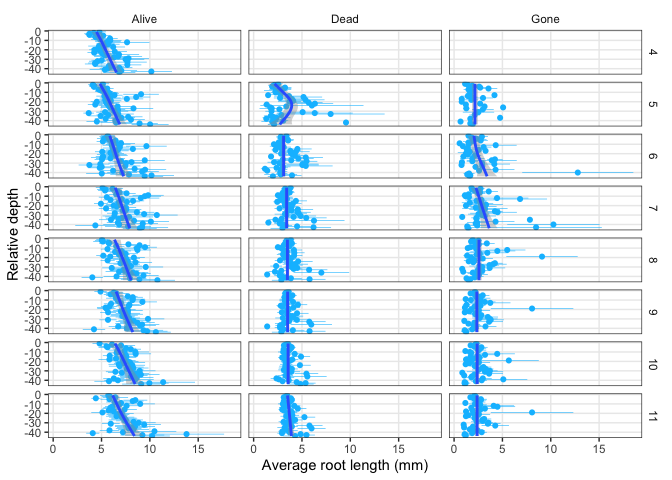

Root production and turnover
================

<!-- ## GitHub Documents -->
<!-- This is an R Markdown format used for publishing markdown documents to GitHub. When you click the **Knit** button all R code chunks are run and a markdown file (.md) suitable for publishing to GitHub is generated. -->

# Generate figures

1.  Length, Production, Turnover by Depth

2.  Length, Production, Turnover by Day of Year (Month)

# Individual roots

## Number of roots across length bins

<!-- -->

<!-- -->

## Root length by depth, month, and status

<!-- -->

## Average root length by depth, month, and status

<!-- -->

# Root length summed to depth (“location”)

<!-- -->
