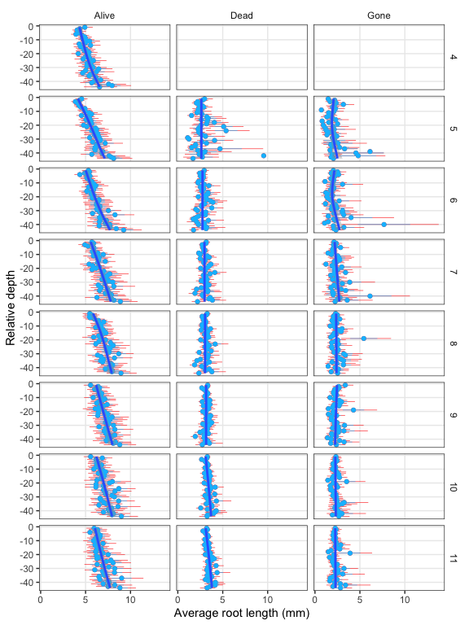

Root production and turnover
================

-   [Calculating Estimates of Root Production and
    Turnover](#calculating-estimates-of-root-production-and-turnover)
-   [Figures](#figures)
    -   [Production and loss (change) of individual
        roots](#production-and-loss-change-of-individual-roots)
    -   [Root measurements aggregated to depth window
        (“location”)](#root-measurements-aggregated-to-depth-window-location)
    -   [Number of roots across size
        bins](#number-of-roots-across-size-bins)
    -   [Individual roots](#individual-roots)
    -   [Averaged individual root
        measurements](#averaged-individual-root-measurements)

<!-- ## GitHub Documents -->
<!-- This is an R Markdown format used for publishing markdown documents to GitHub. When you click the **Knit** button all R code chunks are run and a markdown file (.md) suitable for publishing to GitHub is generated. -->

CW: use MR + models to get at dynamic rates with depth, and static cores
to get biomass/length with depth, then propagate them together to get
summed fluxes of production and turnover.

What changes happen in gross production and turnover?

Need to work on flagging zombies & wanderers

# Calculating Estimates of Root Production and Turnover

<!-- Milchunas (2009): "good agreement between pulse-isotope turnover and minirhizotron were obtained when minirhizotron estimates were *calculated from regression of decomposition versus production to equilibrium* and when pulse-isotope turnover estimates were calculated from two-phase life-span  regressions." -->

Turnover = entering decomposition, sloughing of roots (“gone”);
deposition into the soil

-   individual present then gone (restrictive)
-   individual present but lost size (length and/or diameter; use
    volume? mass)

Split turnover into 2 parts

Alive –&gt; Dead = senescence Alive or Dead –&gt; Gone = turnover
(decomposition)

Alive to gone = senescence + turnover? (but wanderers)

or

Force “dead” before it can be “gone” for turnover definition? Stronger
confidence that it is truly gone into decomposition and turnover rather
than wanderer.

We can infer that “Gone” roots reappearing as “Alive” later were “Alive”
in between observations, but what about the hidden wanderers, those that
haven’t reappeared yet? (Have yet to take any action related to this;
all observations are treated as-is)

Rate/ratio of alive to dead at time t or time t to time t-1

Rate of production of “alive” roots

***New production & new loss for each root, then aggregate to the
frame***

Calculate gross change for individual roots in length, diameter, and
volume between each time step, for alive, dead, gone. The change values
can then be aggregated to the depth window.

-   flag completely new and totally gone?

Balogianni et al. (2016): “**Root production** was defined as the sum of
the length of new roots formed and any increase in length of existing
roots since the previous sampling day (Johnson et al. 2001). **Root
mortality** was defined as the sum of the length of roots that had
disappeared and any decrease in length of existing roots since the
previous sampling day. Root production and mortality for each interval
was expressed as the average meters of root length that appeared or
disappeared per square meter image area per day (m m−2 days−1) in each
tube.”

Number of new root IDs since initiation in April

April roots: 1403

New roots: 2596

That’s more new root IDs than I thought there would be.

<!-- ## Analyzing individual roots -->
<!-- Rate of appearance in dead and gone column of individual roots -->
<!-- Individual roots days to senescence (dead) or turnover (gone) -->
<!-- Kaplan-Meier or Cox proportional hazard regression -->
<!-- - days to event (senescence or turnover) for individual roots -->
<!-- - 30-day step -->
<!-- Kaplan-Meier: estimate median survivorship/longevity of individual or cohort. "Censoring" for alive/dead - roots still alive at end of period results in underestimates longevity. -->
<!-- Cox: estimate "death hazard" at any given time in relation to other covariates -->

# Figures

1.  Length, Diameter, Production, Turnover by Depth

2.  Length, Diameter, Production, Turnover by Day of Year (Month)

<!-- Size (diameter) & depth biplot of days to senescence -->

## Production and loss (change) of individual roots

Calculate gross change for individual roots in length, diameter, and
volume between each time step, for alive, dead, gone. The change values
can then be aggregated to the depth window.

<!-- CW: I think the main change is that we need to separate out the gains and losses. So, ind_gain_sum should actually be split into gross gain and gross loss. Then, the next step is to add new roots into the gross gain, and add newly dead or gone roots to the gross loss. -->
<!-- After doing that, we aggregate to each depth window, but now have gross production and gross turnover by window. -->
<!-- Is "gross loss" then the sum of 'Dead', 'Gone' and negative values of 'Alive'? -->

**Gross Gain** = growth of existing roots + new roots

**Gross Loss** = loss of existing roots + dead roots + gone roots

``` r
## Calculate gross gain and gross loss in length, diameter, and
## volume between each observation for each root

# calculate change of individual roots
## given the definition of gross gain & loss could do only 'Alive'
ind_chg <- df %>% 
  select(obs_ID, root_ID, Tube, Location, Date, Session, Month, root_status, 
         Length_mm, AvgDiam_cm, Volume_mm3) %>% 
  arrange(root_ID, Session) %>% 
  group_by(root_ID, root_status, Tube, Location) %>% 
  # lag subtracts the previous value; NAs when there is no value to subtract
  mutate(length_change = Length_mm - lag(Length_mm, n = 1),
         diam_change = AvgDiam_cm - lag(AvgDiam_cm, n = 1),
         volume_change = Volume_mm3 - lag(Volume_mm3, n = 1)) %>% 
  ungroup(.)

## Not a very elegant solution follows...
ind_gross_chg <- ind_chg %>% 
  # select(-Length_mm:-Volume_mm3) %>%
  rename(length = length_change, diameter = diam_change, 
         volume = volume_change) %>% 
  # long format to use metric as grouping variable
  pivot_longer(length:volume)

# gross gain = growth of 'Alive' + new roots
growth <- ind_gross_chg %>% 
  # summarise growth of existing roots to each depth
  filter(root_status == 'Alive', value >= 0) %>% 
  group_by(Tube, Location, Month, name) %>% 
  summarise(root_growth = sum(value)) %>% 
  ungroup(.)
# summary(growth)

# New roots after April
new_roots <- ind_gross_chg %>%
  # only roots that have NA for the change value
  filter(Month > 4, root_status == 'Alive', is.na(value)) %>% 
  distinct(root_ID, Tube, Location, Month) %>% 
  # get only these root IDs & recombine with gross values
  left_join(., ind_chg %>% select(root_ID, Tube, Location, Month, Length_mm:Volume_mm3)) %>%
  # rename in prep for joining with 'growth' data frame
  rename(length = Length_mm, diameter = AvgDiam_cm, 
         volume = Volume_mm3) %>%
  # match data format of 'growth'
  pivot_longer(length:volume) %>% 
  group_by(Tube, Location, Month, name) %>% 
  summarise(new_roots = sum(value)) %>% 
  ungroup(.)
# join growth with new roots
gain_depth <- left_join(growth, new_roots)
# add growth & new roots to get gross gain
gain_depth <- gain_depth %>% 
  mutate(
    # hacky solve of NAs from the join
    new_roots = ifelse(is.na(new_roots), 0, new_roots),
    gross_gain = root_growth + new_roots
    )

# gross loss = loss in 'Alive' + 'Dead' + 'Gone' 
# get loss in 'Alive' roots (analogous to 'growth')
loss <- ind_gross_chg %>%
  filter(root_status == 'Alive' & value < 0) %>% 
  group_by(Tube, Location, Month, name) %>% 
  summarise(root_loss = sum(abs(value))) %>% 
  ungroup(.)

# get amounts *newly* 'Dead' and 'Gone' roots (analogous to new_roots)
dead_gone <- ind_gross_chg %>%
  # only Dead & Gone roots that have NA for the change value
  filter(Month > 4, root_status %in% c('Dead', 'Gone'),
         is.na(value)) %>% 
  # get only these root IDs & recombine with gross values
  distinct(root_ID, Tube, Location, Month) %>% 
  left_join(., ind_chg %>% select(root_ID, Tube, Location, Month, Length_mm:Volume_mm3)) %>%
  rename(length = Length_mm, diameter = AvgDiam_cm,
         volume = Volume_mm3) %>%
  pivot_longer(length:volume) %>% 
  group_by(Tube, Location, Month, name) %>% 
  summarise(dg_roots = sum(value)) %>% 
  ungroup(.)

loss_depth <- left_join(dead_gone, loss)
loss_depth <- loss_depth %>% 
  mutate(root_loss = ifelse(is.na(root_loss), 0, root_loss),
    gross_loss = dg_roots + root_loss)

# Combine so that gross gain and gross loss are in one data frame
gross_change <- df %>%
  filter(Month > 4) %>% 
  distinct(Tube, Location, Month) %>% 
  left_join(., gain_depth) %>% 
  left_join(., loss_depth)
```

Figure of gross gain and gross loss aggregated to depth window.

<!-- -->

## Root measurements aggregated to depth window (“location”)

The sum of each metric was calculated at each combination of Tube,
Location (depth), Month & Date (equivalent but keeping Date handy), and
root\_status.

In the plots, points are the sum values and lines are the fit from
`geom_smooth(method = 'gam', formula = 'y ~ s(x, bs="cs)')`.

We have totals for:

-   root length (mm)
-   projected area (mm2)
-   surface area (mm2)
-   average diameter (cm)
-   volume (mm3)

<!-- -->

“It develops mid-section girth - a beer belly - over the season” -CW :)

<!-- -->

<!-- -->

<!-- Are these surface area estimates of current interest? -->

## Number of roots across size bins

<!-- add diameter bins -->

<!-- --><!-- -->

<!-- --><!-- -->

## Individual roots

Plotted metrics by depth, month, and status

<!-- -->

<!-- -->

## Averaged individual root measurements

Root length, diameter, and volume by depth, month, and status.

Points are means, blue error bars are standard errors, red are 95% CI.
Both calculated using `stat_summary()` implementation. The line is the
fit from `geom_smooth(method = 'gam', formula = 'y ~ s(x, bs="cs)')`,
the default action in this case.

<!-- Add figure of medians, mode, explore using standard deviation -->

<!-- -->

<!-- -->

<!-- -->
